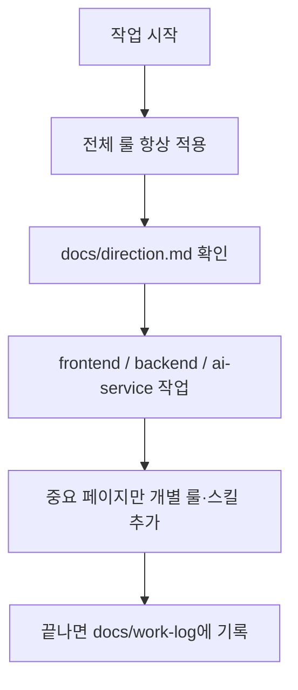

# 양극재 품질 AI 예측 시스템

이 저장소는 **한 프로젝트 안에 여러 패키지**를 둔 모노레포입니다.  
화면(UI), 서버(API), AI 서비스를 각각 폴더로 나눠 관리합니다.

---

## 처음 오셨다면 (5분 가이드)

| 순서 | 할 일 | 파일 |
|------|--------|------|
| 1 | 지금 무엇을 만들고 있는지 확인 | [`docs/direction.md`](./docs/direction.md) |
| 2 | 화면만 돌려보기 | 아래 [화면 실행](#화면-실행-frontend) → [`frontend/README.md`](./frontend/README.md) |
| 3 | **챗봇까지** 실연동 | 아래 [로컬 실행 — 챗봇](#로컬-실행--챗봇-터미널-3개) (frontend + backend + ai-service) |
| 4 | (선택) AI·문서 규칙이 어떻게 돌아가는지 | 아래 [문서와 AI 규칙](#문서와-ai-규칙-어떻게-나뉘나) |

**사람용 긴 설명**은 이 README와 `docs/`에,  
**AI가 짧게 지키는 규칙**은 [`AGENTS.md`](./AGENTS.md)에 있습니다.

---

## 이 저장소에 무엇이 있나

| 폴더 / 파일 | 하는 일 | 상태 |
|-------------|---------|------|
| [`frontend/`](./frontend/) | 웹 화면 (Next.js) | AppShell + 전역 GlobalChatbot + 각 페이지 |
| [`backend/`](./backend/) | 서버 API (Express + MariaDB) | 챗 세션 · 보안 게이트 · ai-service 프록시 |
| [`ai-service/`](./ai-service/) | ML 진단 · FastAPI · LangGraph 챗봇 | `/predict`, `/chat` + LLM failover + models |
| [`docs/`](./docs/) | 팀 전체 방향 · 작업 일지 · 계획 | 사용 중 |
| [`AGENTS.md`](./AGENTS.md) | AI용 **짧은** 공통 규칙 | 사용 중 |

```
KDT-Project/
├── docs/          ← 사람·팀이 읽는 “전체” 기록
├── frontend/      ← 화면
├── backend/       ← 서버
├── ai-service/    ← AI
├── AGENTS.md      ← AI용 공통 규칙 (짧게)
├── .cursor/       ← Cursor 룰·스킬
└── .agents/       ← Codex 등 에이전트 스킬
```

---

## 화면 실행 (frontend)

```bash
cd frontend
npm install
npm run dev
```

브라우저: [http://localhost:3000](http://localhost:3000)

스택, 페이지 목록, 체크리스트는 **[`frontend/README.md`](./frontend/README.md)** 에만 자세히 적어 두었습니다.

---

## 로컬 실행 — 챗봇 (터미널 3개)

챗봇 실연동은 **frontend · backend · ai-service** 를 각각 켭니다.  
MariaDB에 스키마를 한 번 적용해야 합니다 (`backend/src/sql/schema.sql`).

| 터미널 | 패키지 | 포트 | 역할 |
|--------|--------|------|------|
| 1 | `ai-service/` | **8800** | FastAPI · `/health` · `/predict` · `/chat` |
| 2 | `backend/` | **3001** | Express · 세션 · 보안 게이트 · 프록시 |
| 3 | `frontend/` | **3000** | Next.js UI · AppShell 전역 챗봇 |

### 0) MariaDB (최초 1회)

```bash
mysql -u root -p -e "CREATE DATABASE IF NOT EXISTS kdt CHARACTER SET utf8mb4;"
mysql -u root -p kdt < backend/src/sql/schema.sql
```

`backend/.env.example` → `.env` 로 복사 후 DB 비밀번호 설정.

### 터미널 1 — ai-service

```bash
cd ai-service
pip install -r requirements.txt
# (선택) copy .env.example .env 후 CHAT_USE_LLM=1 + API 키
uvicorn app.main:app --host 127.0.0.1 --port 8800
```

확인: [http://127.0.0.1:8800/health](http://127.0.0.1:8800/health)  
**작업 디렉터리는 항상 `ai-service/`** (`models/` 상대 경로).

### 터미널 2 — backend

```bash
cd backend
npm run dev
```

확인: [http://127.0.0.1:3001/api/health](http://127.0.0.1:3001/api/health)

### 터미널 3 — frontend

```bash
cd frontend
npm install
npm run dev
```

확인: [http://localhost:3000](http://localhost:3000)  
rewrite 변경 뒤에는 **Next를 한 번 재시작**합니다.

### 요청 흐름

```text
브라우저 (localhost:3000)
  → POST /api/chat   (Next rewrite → backend :3001)
  → 보안 키워드? → security_redirect (LLM 미호출)
  → 아니면 ai-service :8800/chat
  → LangGraph predict + LLM(priority) 또는 template
  → 답변 말풍선
```

- UI: `frontend/src/components/chat/GlobalChatbot.tsx`
- API 클라이언트: `frontend/src/api/aiApi.ts` (`POST /api/chat`, `session_id`)
- rewrite: `frontend/next.config.ts` — `/api` → `:3001`, `/ai` → `:8800`
- 보안 탭 골격: `/security` · [`docs/references/security-chat-skeleton.md`](./docs/references/security-chat-skeleton.md)
- 우하단 챗봇 → 「샘플 LOT 진단」으로 predict 연동 확인

연동 작업서: [`docs/plans/2026-07-23-llm-formal-integration.md`](./docs/plans/2026-07-23-llm-formal-integration.md)

---

## 기술 스택 (모노레포)

패키지별로 README에도 동일하게 유지합니다. **새 라이브러리를 설치하면 해당 README 기술 스택을 반드시 갱신**합니다. (룰: `.cursor/rules/ask-before-run.mdc`)

### frontend
- Next.js (App Router), React, TypeScript, Tailwind CSS
- Zustand, Axios, Recharts, Lucide React, Day.js  
→ 상세: [`frontend/README.md`](./frontend/README.md)

### backend
- Express, TypeScript (tsx), MariaDB, CORS, dotenv  
→ 상세: [`backend/README.md`](./backend/README.md)

### ai-service
- Python 3.11+, Polars, NumPy, scikit-learn, XGBoost, CatBoost, Optuna, SHAP, joblib
- FastAPI, Uvicorn, Pydantic  
- LangGraph, LangChain Core, LangChain OpenAI, LangChain Google GenAI (선택)  
- Secure RAG: qdrant-client, sentence-transformers, rank-bm25, torch, llama-index-core, llama-index-llms-openai, llama-index-vector-stores-qdrant (bge-m3 / bge-reranker CPU · Self-Query via VectorIndexAutoRetriever)  
→ 상세: [`ai-service/README.md`](./ai-service/README.md)

---

## AI 서비스 실행 (ai-service)

챗봇·진단 API만 단독으로 켤 때:

```bash
cd ai-service
pip install -r requirements.txt
uvicorn app.main:app --host 127.0.0.1 --port 8800
```

| 엔드포인트 | 설명 |
|------------|------|
| `GET /health` | 상태 · 모델 버전 |
| `POST /predict` | O/X 1행 진단 |
| `POST /chat` | LangGraph 챗봇 (backend가 프록시) |
| `POST /security-chat` | 보안 탭 · vLLM + secure RAG |

화면과 같이 쓰려면 위 [로컬 실행 — 챗봇](#로컬-실행--챗봇-터미널-3개)처럼 **backend·frontend도 함께** 켭니다.  
자세한 스택·산출물: **[`ai-service/README.md`](./ai-service/README.md)**.

---

## 문서와 AI 규칙, 어떻게 나뉘나

처음 보면 `README` / `AGENTS` / `docs` / `.cursor`가 헷갈릴 수 있습니다.  
역할을 이렇게 기억하면 됩니다.

| 구분 | 누구를 위한가 | 어디에 있나 | 무엇을 담나 |
|------|----------------|-------------|-------------|
| **루트 README** (이 파일) | 사람 | `/README.md` | 저장소 지도, 실행 입구, **모노레포 기술 스택**, 규칙이 **어떻게** 도는지 |
| **루트 AGENTS** | AI | `/AGENTS.md` | 전 패키지 공통으로 지킬 **짧은** bullet |
| **frontend README** | 사람 | `/frontend/README.md` | FE만의 실행법·스택·진행 상황 |
| **frontend AGENTS** | AI | `/frontend/AGENTS.md` | FE만의 **추가** 규칙 + 루트 AGENTS 안내 |
| **ai-service README** | 사람 | `/ai-service/README.md` | AI 실행법·ML/API 스택 |
| **docs/** | 사람 (+ AI가 방향 확인) | `/docs/` | 오늘 할 일, 일지, 확정 계획 (긴 본문) |

한 줄로:

- **README** = 설명서 (사람)
- **AGENTS** = 수칙 규칙 (AI, 짧게)
- **docs** = 업무 일지·방향 (상세)

---

## AI 룰·스킬이 실제로 어떻게 도나

Cursor 같은 AI는 아래 순서로 움직이도록 맞춰 두었습니다.



### 전체 vs 개별

| 종류 | 의미 | 예 |
|------|------|-----|
| **전체 룰** | 저장소 **어디를** 건드려도 적용 | `main-project.mdc`, `docs-workflow.mdc` |
| **전체 스킬** | 작업을 어디에 맡길지 조율 | `project-control` |
| **개별 룰·스킬** | **특정 중요 화면·API**만 | Setting / Management 페이지, `*-api` |
| **docs** | “지금 방향·어제 한 일” 기록 | `docs/direction.md`, `docs/work-log/` |

### 자주 보는 파일

| 파일 | 역할 |
|------|------|
| [`docs/direction.md`](./docs/direction.md) | 지금 우선순위 |
| [`docs/plans/2026-07-23-session-handoff.md`](./docs/plans/2026-07-23-session-handoff.md) | **PC 재시작 후 이어하기** (2026-07-23 체크포인트) |
| [`docs/work-log/`](./docs/work-log/) | 날짜별 상세 작업 기록 |
| [`.cursor/rules/`](./.cursor/rules/) | 전체·개별 룰 |
| [`.cursor/skills/`](./.cursor/skills/) | Cursor 스킬 |

문서 목차: [`docs/README.md`](./docs/README.md)

---

## 관련 문서

- 프론트 상세: [`frontend/README.md`](./frontend/README.md)
- AI 공통 규칙: [`AGENTS.md`](./AGENTS.md)
- 작업 방향: [`docs/direction.md`](./docs/direction.md)
