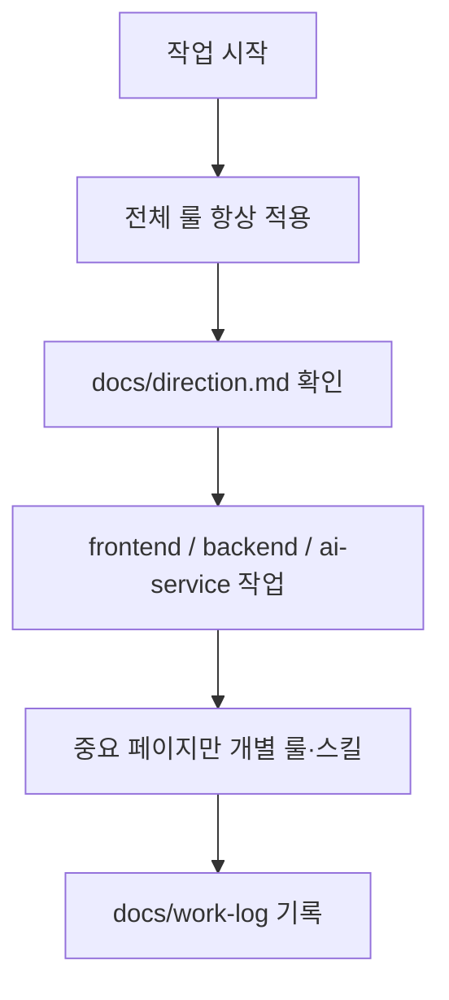

# 양극재 품질 AI 예측 시스템

[](#이-저장소에-무엇이-있나)
[](./docs/direction.md)

양극재 공정 **O/X · 용량 · 잔여 Li** 예측과 **일반/보안 챗봇**을 한 저장소에서 돌리는 모노레포입니다.  
화면(UI) · 서버(API) · AI 서비스를 폴더로 나눕니다.

---

## 처음 오셨다면 (5분 가이드)

| 순서 | 할 일 | 바로가기 |
|------|--------|----------|
| 1 | 지금 무엇을 만들고 있는지 | [`docs/direction.md`](./docs/direction.md) |
| 2 | 화면만 돌려보기 | [화면 실행](#화면-실행-frontend) · [`frontend/README.md`](./frontend/README.md) |
| 3 | **챗봇까지** 실연동 | [로컬 실행 — 챗봇](#로컬-실행--챗봇) |
| 4 | 보안 탭 · secure RAG | [`docs/references/secure-rag.md`](./docs/references/secure-rag.md) |
| 5 | (선택) 문서·AI 규칙 구조 | [문서와 AI 규칙](#문서와-ai-규칙-어떻게-나뉘나) |

**사람용 설명** → 이 README · `docs/`  
**AI용 짧은 규칙** → [`AGENTS.md`](./AGENTS.md)

---

## 이 저장소에 무엇이 있나

| 폴더 / 파일 | 하는 일 | 상태 (요약) |
|-------------|---------|-------------|
| [`frontend/`](./frontend/) | Next.js UI · AppShell · GlobalChatbot · Maximize 보안 오버레이 | Main·Dashboard·Management·Setting·Issue·Knowledge·Inquiry · `/security` |
| [`backend/`](./backend/) | Express API · 세션 · 보안 게이트 · LLM 키(DB) · ai-service 프록시 | chat / security-chat / control·outcome · auth |
| [`ai-service/`](./ai-service/) | FastAPI · clf/reg/residual · LangGraph · **secure RAG** | `/predict*` · `/chat` · `/security-chat` · `models/` |
| [`docs/`](./docs/) | 방향 · 일지 · 계획 · 스키마 참조 | 사용 중 · [오늘 일지](./docs/work-log/2026-07-30.md) |
| [`AGENTS.md`](./AGENTS.md) | AI 공통 bullet | 사용 중 |

```text
KDT-Project/
├── docs/          ← 사람·팀 “전체” 문서
├── frontend/      ← 화면 (:3000)
├── backend/       ← 서버 (:3001)
├── ai-service/    ← AI (:8800)
├── AGENTS.md
├── .cursor/       ← Cursor 룰·스킬
└── .agents/       ← 에이전트 스킬
```

### 제품 한눈에

| 채널 | 경로 | 비고 |
|------|------|------|
| 일반 챗 | 우하단 GlobalChatbot → `POST /api/chat` | Groq/Gemini 등 **등록 키** · predict 헤드(clf·용량·잔여 Li) · what-if |
| 보안 챗 | Maximize 또는 `/security` → `POST /api/security-chat` | **클라우드 폴백 없음** · 로컬 LLM(`:8001`) + Qdrant RAG · 기본은 문서 발췌(`SECURE_GENERATE=0`) |
| 진단 API | ai-service `/predict`, `/predict-capacity`, `/predict-residual` | 학습 산출물 `ai-service/models/` |

---

## 화면 실행 (frontend)

```bash
cd frontend
npm install
npm run dev
```

브라우저: [http://localhost:3000](http://localhost:3000)

페이지·스택·체크리스트는 **[`frontend/README.md`](./frontend/README.md)** 에만 자세히 둡니다.

---

## 로컬 실행 — 챗봇

실연동은 **frontend · backend · ai-service** 를 켭니다.  
보안 RAG까지 쓰려면 **Qdrant(:6333)** 와 (요약 LLM 사용 시) **LM Studio / vLLM(:8001)** 도 필요합니다.

| 터미널 | 패키지 | 포트 | 역할 |
|--------|--------|------|------|
| 1 | `ai-service/` | **8800** | FastAPI · predict · chat · security-chat |
| 2 | `backend/` | **3001** | Express · 세션 · 게이트 · 프록시 |
| 3 | `frontend/` | **3000** | Next.js · GlobalChatbot · 보안 오버레이 |
| (선택) | Qdrant | **6333** | secure RAG 벡터 인덱스 |
| (선택) | LM Studio 등 | **8001** | 보안 탭 OpenAI 호환 LLM |

### 0) DB (최초)

채팅 세션 기본은 **sqlite** (`CHAT_STORE=sqlite`)라 MariaDB 없이도 챗은 됩니다.  
MariaDB를 쓸 때만:

```bash
mysql -u root -p -e "CREATE DATABASE IF NOT EXISTS kdt CHARACTER SET utf8mb4;"
mysql -u root -p kdt < DB/chat_schema.sql
```

`backend/.env.example` → `.env` 복사 후 필요한 값 설정.  
**API 키·시크릿은 커밋하지 마세요.**

### 터미널 1 — ai-service

```bash
cd ai-service
pip install -r requirements.txt
# .env: CHAT_USE_LLM=1 · CHAT_VLLM_* (보안) · SECURE_* (RAG)
# 보안 문서 인덱싱(승인 후): python ingest_secure.py
uvicorn app.main:app --host 127.0.0.1 --port 8800
```

- Health: [http://127.0.0.1:8800/health](http://127.0.0.1:8800/health)  
- **CWD는 항상 `ai-service/`** (`models/` 상대 경로)

### 터미널 2 — backend

```bash
cd backend
npm run dev
```

Health: [http://127.0.0.1:3001/api/health](http://127.0.0.1:3001/api/health)

### 터미널 3 — frontend

```bash
cd frontend
npm install
npm run dev
```

UI: [http://localhost:3000](http://localhost:3000)  
rewrite 변경 후 Next를 **한 번 재시작**합니다.

### 요청 흐름

**일반 챗**

```text
브라우저 :3000
  → POST /api/chat  (Next rewrite → backend :3001)
  → 보안 키워드? → security_redirect
  → 아니면 ai-service :8800/chat
  → LangGraph predict + LLM(등록 키) 또는 template
```

**보안 챗**

```text
Maximize / /security
  → POST /api/security-chat → :8800/security-chat
  → RAG (Qdrant + BM25 + RRF + CPU rerank)
  → SECURE_GENERATE=0 → 문서 발췌 + [출처:]
     또는 =1 → 로컬 LLM(:8001) 요약 (느리면 extractive 폴백)
```

| 항목 | 경로 |
|------|------|
| 일반 UI | `frontend/src/components/chat/GlobalChatbot.tsx` |
| 보안 UI | `frontend/src/components/chat/SecurityChatbot.tsx` |
| rewrite | `frontend/next.config.ts` — `/api`→`:3001`, `/ai`→`:8800` |
| 보안 RAG | [`docs/references/secure-rag.md`](./docs/references/secure-rag.md) |
| 스모크 | `cd ai-service && python scripts/smoke_secure_rag_e2e.py` |

우하단 챗봇 → 「샘플 LOT 진단」으로 predict 연동을 확인할 수 있습니다.

---

## 기술 스택 (모노레포)

패키지 README와 맞춥니다. **새 의존성 설치 시 해당 README 스택을 반드시 갱신**합니다. (`.cursor/rules/ask-before-run.mdc`)

### frontend
- Next.js (App Router), React, TypeScript, Tailwind CSS  
- Zustand, Axios, Recharts, Lucide React, Day.js  
→ [`frontend/README.md`](./frontend/README.md)

### backend
- Express, TypeScript (tsx), MariaDB / sqlite 채팅 스토어, CORS, dotenv  
- Auth: bcryptjs, jsonwebtoken  
→ [`backend/README.md`](./backend/README.md)

### ai-service
- Python 3.11+, Polars, NumPy, scikit-learn, XGBoost, CatBoost, Optuna, SHAP, joblib, openpyxl  
- FastAPI, Uvicorn, Pydantic · LangGraph / LangChain  
- Secure RAG: qdrant-client, sentence-transformers, rank-bm25, torch, llama-index-core, llama-index-llms-openai, llama-index-vector-stores-qdrant  
  (bge-m3 / bge-reranker **CPU** · Self-Query = `VectorIndexAutoRetriever`)  
→ [`ai-service/README.md`](./ai-service/README.md)

---

## AI 서비스 실행 (ai-service)

챗봇·진단 API만 단독으로:

```bash
cd ai-service
pip install -r requirements.txt
uvicorn app.main:app --host 127.0.0.1 --port 8800
```

| 엔드포인트 | 설명 |
|------------|------|
| `GET /health` | 상태 · `registry_ready` 헤드 |
| `POST /predict` | O/X (clf) |
| `POST /predict-capacity` | 용량 (reg) |
| `POST /predict-residual` | 잔여 Li |
| `POST /chat` | 일반 LangGraph 챗 (backend 프록시) |
| `POST /security-chat` | 보안 · RAG (+ 선택 로컬 LLM) |

학습·스키마·레지스트리: **[`ai-service/README.md`](./ai-service/README.md)** · [`docs/references/`](./docs/references/).

---

## 문서와 AI 규칙, 어떻게 나뉘나

| 구분 | 누구 | 위치 | 무엇을 |
|------|------|------|--------|
| **루트 README** | 사람 | `/README.md` | 지도 · 실행 · 모노레포 스택 |
| **루트 AGENTS** | AI | `/AGENTS.md` | 전 패키지 **짧은** 규칙 |
| **패키지 README** | 사람 | `frontend/` · `backend/` · `ai-service/` | 각 실행법·스택 |
| **docs/** | 사람 (+ AI가 방향 확인) | `/docs/` | 방향 · 일지 · 계획 · 스키마 |

- **README** = 설명서  
- **AGENTS** = AI 수칙 (짧게)  
- **docs** = 업무 방향·일지 (상세)

---

## AI 룰·스킬이 실제로 어떻게 도나



| 종류 | 의미 | 예 |
|------|------|-----|
| **전체 룰** | 어디를 건드려도 | `main-project.mdc`, `docs-workflow.mdc`, `ask-before-run.mdc` |
| **전체 스킬** | 조율 | `project-control` |
| **개별 룰·스킬** | 특정 화면·API | Setting / Management · `*-api` |
| **docs** | 지금 방향·일자별 일지 | `direction.md`, `work-log/` |

### 자주 보는 파일

| 파일 | 역할 |
|------|------|
| [`docs/direction.md`](./docs/direction.md) | 지금 우선순위 |
| [`docs/work-log/2026-07-30.md`](./docs/work-log/2026-07-30.md) | 최근 상세 (보안 RAG · E2E · 발췌 모드) |
| [`docs/references/secure-rag.md`](./docs/references/secure-rag.md) | 보안 RAG · env · 스모크 |
| [`docs/references/vllm-setup.md`](./docs/references/vllm-setup.md) | 로컬 LLM(:8001) 수동 기동 |
| [`.cursor/rules/`](./.cursor/rules/) | Cursor 룰 |

목차: [`docs/README.md`](./docs/README.md)

---

## 관련 문서

- 프론트: [`frontend/README.md`](./frontend/README.md)  
- 백엔드: [`backend/README.md`](./backend/README.md)  
- AI: [`ai-service/README.md`](./ai-service/README.md)  
- AI 규칙: [`AGENTS.md`](./AGENTS.md)  
- 작업 방향: [`docs/direction.md`](./docs/direction.md)
