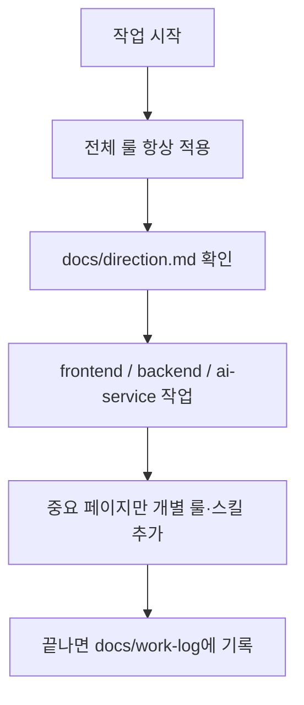

# 양극재 품질 AI 예측 시스템

이 저장소는 **한 프로젝트 안에 여러 패키지**를 둔 모노레포입니다.  
화면(UI), 서버(API), AI 서비스를 각각 폴더로 나눠 관리합니다.

---

## 처음 오셨다면 (5분 가이드)

| 순서 | 할 일 | 파일 |
|------|--------|------|
| 1 | 지금 무엇을 만들고 있는지 확인 | [`docs/direction.md`](./docs/direction.md) |
| 2 | 화면을 돌려보기 | 아래 [화면 실행](#화면-실행-frontend) → 자세한 내용은 [`frontend/README.md`](./frontend/README.md) |
| 3 | (선택) AI·문서 규칙이 어떻게 돌아가는지 | 아래 [문서와 AI 규칙](#문서와-ai-규칙-어떻게-나뉘나) |

**사람용 긴 설명**은 이 README와 `docs/`에,  
**AI가 짧게 지키는 규칙**은 [`AGENTS.md`](./AGENTS.md)에 있습니다.

---

## 이 저장소에 무엇이 있나

| 폴더 / 파일 | 하는 일 | 상태 |
|-------------|---------|------|
| [`frontend/`](./frontend/) | 웹 화면 (Next.js) | AppShell + Main·Dashboard·Issue·Knowledge·Inquiry·Management·Setting |
| [`backend/`](./backend/) | 서버 API (Express + MariaDB) | 준비 중 |
| [`ai-service/`](./ai-service/) | AI 관련 서비스 | 준비 중 |
| [`docs/`](./docs/) | 팀 전체 방향 · 작업 일지 · 계획 | 사용 중 |
| [`AGENTS.md`](./AGENTS.md) | AI용 **짧은** 공통 규칙 | 사용 중 |

```
KDT-Project/
├── docs/          ← 사람·팀이 읽는 “전체” 기록
├── frontend/      ← 화면
├── backend/       ← 서버
├── ai-service/    ← AI
├── AGENTS.md      ← AI용 공통 규칙 (짧게)
├── .cursor/       ← Cursor 룰·스킬
└── .agents/       ← Codex 등 에이전트 스킬
```

---

## 화면 실행 (frontend)

```bash
cd frontend
npm install
npm run dev
```

브라우저: [http://localhost:3000](http://localhost:3000)

스택, 페이지 목록, 체크리스트는 **[`frontend/README.md`](./frontend/README.md)** 에만 자세히 적어 두었습니다.

---

## 문서와 AI 규칙, 어떻게 나뉘나

처음 보면 `README` / `AGENTS` / `docs` / `.cursor`가 헷갈릴 수 있습니다.  
역할을 이렇게 기억하면 됩니다.

| 구분 | 누구를 위한가 | 어디에 있나 | 무엇을 담나 |
|------|----------------|-------------|-------------|
| **루트 README** (이 파일) | 사람 | `/README.md` | 저장소 지도, 실행 입구, 규칙이 **어떻게** 도는지 |
| **루트 AGENTS** | AI | `/AGENTS.md` | 전 패키지 공통으로 지킬 **짧은** bullet |
| **frontend README** | 사람 | `/frontend/README.md` | FE만의 실행법·스택·진행 상황 |
| **frontend AGENTS** | AI | `/frontend/AGENTS.md` | FE만의 **추가** 규칙 + 루트 AGENTS 안내 |
| **docs/** | 사람 (+ AI가 방향 확인) | `/docs/` | 오늘 할 일, 일지, 확정 계획 (긴 본문) |

한 줄로:

- **README** = 설명서 (사람)
- **AGENTS** = 수칙 규칙 (AI, 짧게)
- **docs** = 업무 일지·방향 (상세)

---

## AI 룰·스킬이 실제로 어떻게 도나

Cursor 같은 AI는 아래 순서로 움직이도록 맞춰 두었습니다.



### 전체 vs 개별

| 종류 | 의미 | 예 |
|------|------|-----|
| **전체 룰** | 저장소 **어디를** 건드려도 적용 | `main-project.mdc`, `docs-workflow.mdc` |
| **전체 스킬** | 작업을 어디에 맡길지 조율 | `project-control` |
| **개별 룰·스킬** | **특정 중요 화면·API**만 | Setting / Management 페이지, `*-api` |
| **docs** | “지금 방향·어제 한 일” 기록 | `docs/direction.md`, `docs/work-log/` |

### 자주 보는 파일

| 파일 | 역할 |
|------|------|
| [`docs/direction.md`](./docs/direction.md) | 지금 우선순위 |
| [`docs/work-log/`](./docs/work-log/) | 날짜별 상세 작업 기록 |
| [`.cursor/rules/`](./.cursor/rules/) | 전체·개별 룰 |
| [`.cursor/skills/`](./.cursor/skills/) | Cursor 스킬 |

문서 목차: [`docs/README.md`](./docs/README.md)

---

## 관련 문서

- 프론트 상세: [`frontend/README.md`](./frontend/README.md)
- AI 공통 규칙: [`AGENTS.md`](./AGENTS.md)
- 작업 방향: [`docs/direction.md`](./docs/direction.md)
