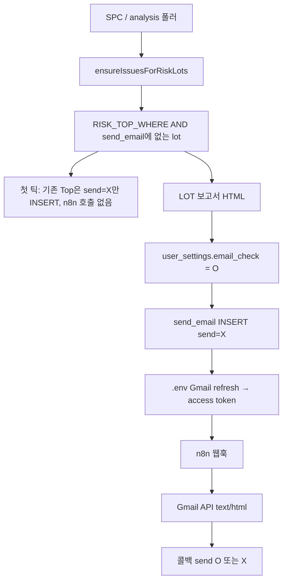

# 위험 LOT Top → n8n 이슈 보고서 메일 (확정)

최종 갱신: 2026-08-13  
상태: 구현  
관련: [`docs/references/issue-lot-api.md`](../references/issue-lot-api.md)

메인 「위험 LOT Top」과 같은 조건의 LOT이 **새로** 생기면, 이슈 관리 「PDF 다운로드」와 같은 LOT 보고서 HTML을 n8n → Google Cloud Gmail API로 보낸다. 이미 쌓여 있는 과거 LOT는 보내지 않는다.

---

## 결정 요약

| 항목 | 결정 |
|------|------|
| 트리거 | `risk_level = '심각'` **그리고** `lots.timestamp` 최근 3일 |
| 본문 | LOT 보고서 HTML (미완료 이슈만). `mail_contents` LONGTEXT. JSON/PDF 바이너리 아님 |
| 채널 | INSERT `send_email` → n8n 웹훅 → Gmail API `text/html` → 콜백 `send` O/X |
| 자격 증명 | 모노레포 **루트 `.env`** (`loadRootEnv`). n8n Credential UI에 키를 두지 않음 |
| 수신자 | `user_settings.email_check = 'O'` 인 `users` |
| 중복 | LOT당 1회. `send_email`에 행이 있으면 `send`가 X여도 **재시도하지 않음** |
| 과거 데이터 | 기능 첫 틱에 이미 Top인 LOT는 `send='X'` + `baseline_skip`만 넣고 발송하지 않음 |
| UI | 이슈 페이지 「PDF 다운로드」 유지. 설정 「n8n 알림」토글 → `email_check` |

HTML 메일은 소스 코드가 아니라 Gmail/아웃룩에서 표·제목이 있는 문서로 렌더된다. 브라우저 인쇄 PDF와 픽셀 일치는 아니다.

---

## 목표 동작

---

## 테이블

`email_check`는 `user_settings` 컬럼이라 `send_email`이 그 컬럼을 FK로 걸 수 없다. `user_id`로 JOIN 한다.

DDL: [`DB/send_email.sql`](../../DB/send_email.sql) · [`DB/schema.sql`](../../DB/schema.sql)  
마이그레이션: `npm run migrate:send-email` (`backend/`)

### `user_settings.email_check`

CHAR(1) NOT NULL DEFAULT `'X'` — `'O'` 수신 / `'X'` 거부 (옵트인)

### `send_email`

| 컬럼 | 역할 |
|------|------|
| `id` | PK |
| `lot_id` | FK → `lots.id` |
| `user_id` | FK → `users.user_id` |
| `email` | 발송 시점 `users.email` 스냅샷 |
| `mail_contents` | LOT 보고서 HTML |
| `send` | `'O'` 성공 / `'X'` 미발송·실패 (기본 `'X'`) |
| `created_at` / `sent_at` | 생성 · 성공 시각 |
| `error` | 실패 메시지. 첫 틱 스킵은 `baseline_skip` |
| UNIQUE `(lot_id, user_id)` | 사용자당 LOT 1행 |

불러오기: `SELECT mail_contents FROM send_email WHERE lot_id = ? AND user_id = ?;`

---

## 전체 ERD (`DB/schema.sql` + 신규)

```mermaid
erDiagram
  users {
    int id PK
    varchar user_id UK
    varchar password
    varchar name
    varchar phone
    varchar email
    datetime created_at
    datetime updated_at
  }
  user_settings {
    varchar user_id PK
    int font_size
    tinyint theme_mode
    int refresh_interval
    char email_check
    datetime updated_at
  }
  send_email {
    bigint id PK
    varchar lot_id FK
    varchar user_id FK
    varchar email
    longtext mail_contents
    char send
    datetime created_at
    datetime sent_at
    varchar error
  }
  lots {
    varchar id PK
    datetime timestamp
    double d50
    double d90
    double metal_impurity
    double lithium_input
    double additive_ratio
    double process_time
    double sintering_temp
    double humidity
    double tank_pressure
    varchar operator_id
  }
  analysis_lots {
    varchar lot_id PK
    double probability
    varchar spc_status
    varchar risk_level
    varchar risk_reason
    json spc_chart_json
    datetime created_at
    datetime scored_at
  }
  judgment_lots {
    varchar lot_id PK
    tinyint quality_defect
    double capacity
    double residual_li
    double probability
    varchar spc
  }
  lot_recommended_actions {
    varchar lot_id PK
    varchar summary
    json steps_json
    json sources_json
    json drivers_json
    varchar status
    varchar error_message
    char content_hash
    datetime generated_at
  }
  lot_results {
    int seq PK
    varchar lot_id UK
    tinyint quality_defect
    double residual_li
    datetime measured_at
  }
  issues {
    varchar issue_id PK
    varchar lot_id FK
    varchar issue_content
    text action_content
    varchar assignee_user_id FK
    datetime completed_at
    datetime created_at
  }
  handover_history {
    bigint history_id PK
    varchar handover_content
    text action
    varchar handover_from
    varchar handover_to
    varchar assignee_user_id FK
    varchar category
    datetime created_at
    datetime archived_at
  }
  user_chat_threads {
    char id PK
    varchar user_id FK
    varchar channel
    varchar title
    datetime created_at
    datetime updated_at
  }
  user_chat_messages {
    bigint id PK
    char thread_id FK
    varchar role
    text content
    varchar mode
    varchar provider
    json sources
    datetime created_at
  }
  inquiries {
    int id PK
    varchar inquiry_code UK
    varchar category
    varchar visibility
    varchar status
    varchar title
    text content
    varchar author_user_id FK
    varchar author_name
    varchar author_email
    text answer
    datetime answered_at
    varchar answered_by_user_id FK
    datetime created_at
  }
  inquiry_attachments {
    int id PK
    int inquiry_id FK
    varchar original_name
    varchar stored_name
    varchar mime_type
    int size_bytes
    datetime created_at
  }
  AI_Library_analysis {
    bigint id PK
    varchar user_id FK
    varchar name
    text analysis_content
    datetime created_at
  }
  text_match {
    bigint id PK
    varchar source_path UK
    varchar md_path
    varchar clearance
    varchar source_ext
    varchar extract_method
    char source_sha1
    varchar status
    varchar error_message
    datetime created_at
    datetime updated_at
  }
  spc_limits {
    varchar param_key PK
    varchar label
    double LCL_I
    double CL_I
    double UCL_I
    double CL_MR
    double UCL_MR
  }
  standard {
    tinyint id PK
    double defect_prob_caution
    double defect_prob_severe
    double residual_caution
    double residual_severe
    double spare
  }

  users ||--|| user_settings : user_id
  users ||--o{ send_email : user_id
  lots ||--o{ send_email : lot_id
  lots ||--|| analysis_lots : lot_id
  lots ||--|| judgment_lots : lot_id
  lots ||--o| lot_recommended_actions : lot_id
  lots ||--o{ issues : lot_id
  users ||--o{ issues : assignee
  users ||--o{ handover_history : assignee
  users ||--o{ user_chat_threads : user_id
  user_chat_threads ||--o{ user_chat_messages : thread_id
  users ||--o{ inquiries : author
  users ||--o{ inquiries : answerer
  inquiries ||--o{ inquiry_attachments : inquiry_id
  users ||--o{ AI_Library_analysis : user_id
```

---

## 루트 `.env` (SSOT · 값 커밋 금지)

키 이름만 [`backend/.env.example`](../../backend/.env.example). 서비스 계정 JSON 본문·private key를 `.env`/레포/로그/웹훅에 넣지 않는다. `.env`에는 **파일 경로만**.

- `N8N_ISSUE_REPORT_WEBHOOK_URL`
- `N8N_WEBHOOK_SECRET`
- `ISSUE_REPORT_MAIL_ENABLED` (`0`이면 기능 off)
- `ISSUE_REPORT_MAIL_FROM` (No-reply)
- `GOOGLE_MAIL_SERVICE_ACCOUNT_FILE` — GCP 서비스 계정 JSON 경로
- `GOOGLE_MAIL_DELEGATED_USER` — 발신으로 쓸 Workspace 사용자 (도메인 전체 위임)

백엔드는 파일에서 자격 증명을 읽어 **단기 access token**만 n8n 웹훅에 넘긴다.

웹훅 페이로드: `{ id, lotId, to, subject, html, from, noReply, accessToken }`  
제목: `[이슈 보고서] LOT {lotId} · 심각`  
콜백: `POST /api/internal/n8n/send-email-result` `{ id, send }` + `Authorization: Bearer N8N_WEBHOOK_SECRET`

n8n 노드: Webhook → Gmail API(HTML) → HTTP Request(콜백). 워크플로 JSON은 레포에 없음.

---

## 의도적으로 하지 않음

- 주간/월간 보고서 메일
- PDF 바이너리 생성·첨부
- 백엔드 nodemailer/SMTP 직접 발송
- Gmail 키를 n8n Credential UI·레포에 저장
- 완료 이슈(과거 자료)·이미 Top이던 LOT 일괄 발송
- `mail_contents`를 JSON으로 저장
