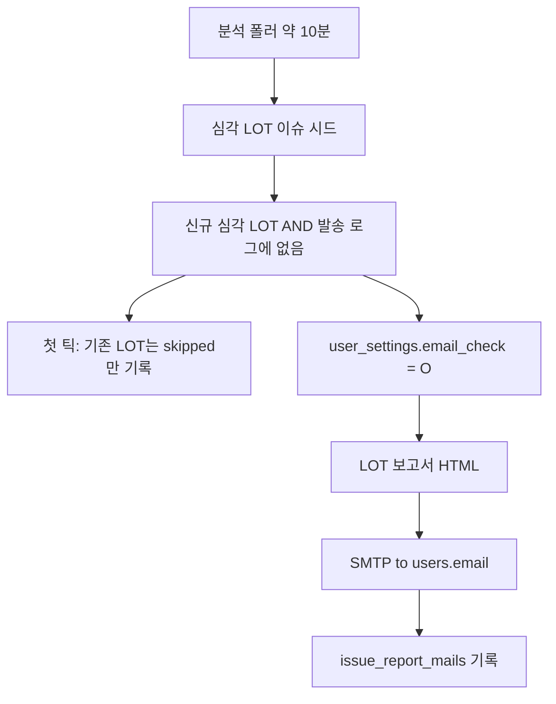

# 위험 LOT 심각 → 이슈 보고서 SMTP 자동 발송 (계획)

최종 갱신: 2026-08-13  
상태: 헤더 알림 토글(`email_check` O/X) 구현됨 · SMTP 발송은 후속  
관련: [`docs/references/issue-lot-api.md`](../references/issue-lot-api.md)

약 10분마다 들어오는 LOT이 **위험등급 심각**이면, 이슈 관리 「PDF 다운로드」와 **같은 내용**의 LOT 보고서를 SMTP로 보낸다.  
수신 여부는 헤더 알림창에서 켜고 끄며, `user_settings.email_check` (`O`/`X`)에 저장한다. 이미 쌓여 있는 과거 LOT는 보내지 않는다.

---

## 결정 요약

| 항목 | 결정 |
|------|------|
| 데이터 주기 | 신규 LOT 약 10분 (분석 폴러 기본 `ANALYSIS_SYNC_INTERVAL_MS=600000`) |
| 트리거 | `risk_level = '심각'` (이슈 시드와 동일). 과거 적재분 미발송 |
| 본문 | 이슈 관리 → 보고서 생성 → PDF 다운로드와 같은 LOT 보고서 HTML (미완료 이슈만) |
| 채널 | 실제 SMTP (`nodemailer`). 자격 증명은 루트 `.env`만 |
| 수신자 | `email_check = 'O'` 인 사용자의 `users.email` |
| 수신 동의 | **기존** `user_settings.email_check` (`O`/`X`). 계정(`user_id`)별로 저장. 컬럼 신규 추가 아님 |
| 동의 UI | 헤더 알림 팝오버 토글 → 로그인 사용자의 해당 행만 `O`↔`X` UPDATE |
| 중복 | LOT당 1통. `issue_report_mails`에 없는 `lot_id`만 |
| 이슈 UI | 「PDF 다운로드」 버튼은 유지. 메일은 백엔드 자동 |

---

## 배경: PDF 다운로드가 어디에 있는가

`docs/` · `Documents/` 안에는 「보고서 생성 / PDF 다운로드」 전용 스펙이 **없다.**

| 구분 | 경로 | 비고 |
|------|------|------|
| 구현 | `frontend/src/app/(shell)/issue/page.tsx` | 「보고서 생성」→ 모달 → 「PDF 다운로드」 |
| 가까운 API 문서 | `docs/references/issue-lot-api.md` | 이슈/LOT/`risk-top`만. PDF 출력 없음 |
| 알림 UI | `frontend/src/components/layout/ShellHeader.tsx` | 종 아이콘 팝오버. 현재 `w-[min(92vw,340px)]` |

화면에서 하는 일:

1. `/issue`에서 「보고서 생성」
2. 유형(LOT / 주간 / 월간) 선택 후 「PDF 다운로드」
3. `buildIssueReportPdfHtml`로 HTML을 만들고 `window.open` + `window.print()`

서버 PDF API가 아니다. 브라우저 인쇄 대화상자이며, 파일 다운로드가 아니다.

보고서 HTML 섹션 (메일도 이것과 맞춘다):

1. 요약 KPI
2. AI·SPC 진단
3. 이슈 목록
4. LOT 상세 분석 (LOT 보고서일 때만)

---

## 목표 동작



1. 약 10분 주기로 LOT이 들어오고 채점된다 (`analysisLotSyncPoller`).
2. `risk_level = '심각'`이면 이슈를 시드한 뒤, **이번에 새로** 심각이 된 LOT만 고른다.
3. `email_check = 'O'`인 사용자에게, PDF와 같은 LOT 보고서 HTML을 보낸다. 완료된 과거 자료는 넣지 않는다.
4. `email_check = 'X'`이거나 이메일이 비어 있으면 그 사용자는 건너뛴다. `O`인 사용자가 없으면 발송하지 않는다.
5. 기능 첫 틱에 이미 있던 심각 LOT는 기록만 하고 보내지 않는다.

---

## 헤더 알림창 UI

현재 팝오버는 좁고(`340px`), 목록이 비면 「새로운 알림이 없습니다.」만 보인다. 설정 토글을  squish하지 않도록 아래처럼 바꾼다.

- 폭: `340px` → 약 `400px` (`w-[min(92vw,400px)]`)
- **하단 고정 바** (알림이 없어도 항상 표시)
  - 제목: 이메일 자동 발신
  - 설명: 위험등급이 심각인 LOT 이슈 보고서를 메일로 받습니다
  - 토글: 켜짐 = 그 계정의 `email_check='O'`, 꺼짐 = `'X'`
- 알림 목록은 기존처럼 위쪽에 유지 (읽음/제거/페이지네이션)
- 종 아이콘 옆 배지는 기존 알림 unread만. 토글 상태와 섞지 않음

토글은 **로그인한 `user_id` 한 행만** 갱신한다.

```sql
UPDATE user_settings SET email_check = 'O' -- 또는 'X'
 WHERE user_id = ?;
```

즉시 `PUT /api/auth/settings` (`emailCheck: 'O' | 'X'`).  
폰트·테마·주기를 기본값으로 덮어쓰지 않도록 **부분 업데이트(merge)**.

로그인 전이면 토글은 비활성. n8n 알림 토글(`/setting`)과는 **별개**.

파일: `frontend/src/components/layout/ShellHeader.tsx`

---

## 구현 계획

### 1. `user_settings.email_check` (이미 DB에 있음)

라이브 `kdt_project.user_settings`에는 **이미** `email_check`가 있다 (`O`/`X`, 계정별).  
할 일은 컬럼 추가가 아니라, **앱이 이 컬럼을 읽고 쓰게 연결**하는 것이다.

| 사실 | 내용 |
|------|------|
| DB | `email_check` 존재. 예: `0000`=`O`, 그 외 다수=`X` |
| 레포 `DB/schema.sql` | 아직 컬럼 미기재 → 문서·신규 환경용으로 **반영만** |
| `userSettings.service.ts` | `font_size` / `theme_mode` / `refresh_interval`만 SELECT/UPDATE. `email_check` 미사용 |

앱 작업:

- `GET /api/auth/settings` → `emailCheck: 'O' \| 'X'` 반환
- `PUT /api/auth/settings` → 로그인 `user_id`의 `email_check`만 `O`/`X`로 UPDATE (다른 계정 행은 변경 없음)
- 토글 켜기 = `O`, 끄기 = `X`. `O`/`X` 이외는 400
- 신규 `user_settings` 행을 만들 때만 기본 `X`
- 수신 주소는 그 계정의 `users.email`

라이브 DB에 `send_email` 테이블도 있으나, **수신 동의 저장은 `email_check`만** 사용한다. 발송 이력은 아래 로그 테이블(또는 기존 `send_email`을 쓰기로 하면 그쪽으로 대체).

### 2. 발송 로그 테이블

`DB/issue_report_mails.sql` + 마이그레이션 + `DB/schema.sql`

| 컬럼 | 역할 |
|------|------|
| `lot_id` | PK, FK → `lots.id` |
| `issue_id` | 당시 대표 이슈 |
| `sent_at` | 실제 발송 시각. baseline은 NULL |
| `skipped` | 1 = 기동 시점 기존 LOT (발송 안 함), 0 = 발송 |
| `error` | 실패 메시지 |

### 3. 보고서 HTML (백엔드)

신규 `backend/src/services/issueReportHtml.ts`

- FE `buildIssueReportPdfHtml`과 같은 4개 섹션
- 해당 `lot_id`의 미완료 이슈 + `analysis_lots` JOIN
- `completed_at IS NOT NULL` 제외
- `window.print()` / PDF 바이너리 첨부 없음

### 4. SMTP

신규 `backend/src/services/issueReportMailer.ts`  
패키지: `nodemailer` (backend, 설치는 승인 후)

자격 증명은 **루트 `.env`만**. 실계정 커밋 금지.

| 변수 | 역할 |
|------|------|
| `SMTP_HOST` | SMTP 호스트 |
| `SMTP_PORT` | 기본 587 |
| `SMTP_SECURE` | `1`이면 TLS |
| `SMTP_USER` / `SMTP_PASS` | 인증 |
| `SMTP_FROM` | 발신 주소 |
| `ISSUE_REPORT_MAIL_ENABLED` | `0`이면 기능 off |

수신자는 env가 아니라 `email_check='O'` 사용자의 `users.email`.  
SMTP가 비거나 `O`인 사용자가 없으면 발송하지 않고 로그만 남긴다.

제목 예: `[이슈 보고서] LOT {lotId} · 심각`

### 5. 트리거 (약 10분)

`dispatchNewRiskTopIssueReports()`를 `ensureIssuesForRiskLots()` 직후에 호출.

- `backend/src/services/analysisLotSyncPoller.ts` (기본 10분) — **주 경로**
- `backend/src/services/spcLotSync.ts` (약 60초)에도 같은 훅을 두면, 채점이 더 빨리 끝나도 LOT당 1통만 나간다

규칙:

- 후보 = `risk_level = '심각'` + 미완료 이슈 + `issue_report_mails`에 없음
- **로그가 비어 있는 첫 틱:** 후보를 `skipped=1`로만 insert
- **이후:** 새 `lot_id`만, `email_check='O'` 전원에게 1통
- 실패 시 `error`를 남기고 다음 틱에서 재시도

### 6. 구현 후 문서

- `docs/references/issue-lot-api.md`
- `docs/references/login-auth-tech-stack.md` (`user_settings`)
- `backend/README.md`, `backend/.env.example`

---

## 의도적으로 하지 않음

- 주간 / 월간 보고서 메일
- PDF 파일 첨부
- 이슈 페이지에 「메일 전송」 버튼
- n8n 토글과 병합
- `ISSUE_REPORT_MAIL_TO` 단일 공용 수신함 (사용자별 `users.email` 사용)
- 완료된 과거 이슈·이미 있던 심각 LOT 일괄 발송

---

## 팀에서 미리 정할 것

루트 `.env`에 SMTP 발신 계정(`SMTP_*`, `SMTP_FROM`)을 넣을 수 있어야 한다.  
수신 메일은 각 사용자의 「내 정보」 이메일을 쓴다.

---

## 검증 (구현 후)

- 알림 팝오버 토글을 켜면 **현재 로그인 계정**의 `user_settings.email_check`가 `O`, 끄면 `X`로 바뀐다. 다른 계정 값은 그대로다
- `email_check=X`만 있으면 심각 LOT이 생겨도 메일 없음
- `O`인 사용자만 `users.email`로 수신
- 첫 기동: 기존 심각 LOT은 메일에 안 감, `skipped=1`
- 이후 신규 심각 LOT 1건 → 동의한 사용자마다 메일 1통 (본문 = PDF와 같은 섹션)
- 같은 LOT 재채점 → 두 번째 메일 없음
- 완료된 이슈는 본문에 없음
- SMTP 미설정 → 프로세스 중단 없음
