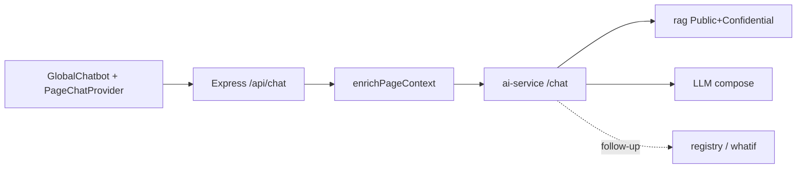

# 화면 컨텍스트 일반 챗 (확정)

최종 갱신: 2026-08-13

Cursor 플랜 `page_context_chatbot` 구현 확정본. 일반 챗(`GlobalChatbot` / `POST /api/chat`)만 해당. 보안 챗은 후속.

## 결정 요약

| 항목 | 결정 |
|------|------|
| 채널 | 일반 챗만 |
| 데이터 | 하이브리드 C: FE 화면 페이로드 우선 + BE allowlist 보충 |
| 포커스 | UI 태그 없음 · `console.debug('[page-chat]', …)` 만 |
| 지식 | Public+Confidential RAG + 화면/API 요약 |
| 턴 | 1턴: page_context + RAG · 추가질문/명시: API_LLM(heads/whatif) |
| 롤아웃 | Main → Dashboard → Issue → Knowledge → SPC(`/management`) |

## PageContext 흐름

필드: `route`, `focusId`, `focusPayload`, `pagePayload`, `supplementHints` (+ BE `supplement`).

우선순위: focusPayload > pagePayload > supplement.

## 구현 위치

- FE: `frontend/src/context/PageChatContext.tsx`, `AppShell`, `GlobalChatbot`, `aiApi.postChat`, 각 shell 페이지 바인딩
- BE: `pageChatContext.service.ts`, `routes/chat.ts`, `aiProxy.ts`
- AI: `schemas.PageContextModel`, `graph.py`(`enable_api_llm`), `prompts.py`, `main.py`

## 의도적으로 하지 않음

- 보안 챗 동일 적용
- focus 칩/디버그 UI 노출
- Secret/TopSecret를 일반 RAG에 열기
- 페이지 API 전체 raw dump

## 검증

- 콘솔 `[page-chat]` route/focus/payload sizes
- Main「이 화면 KPI 요약」→ pagePayload 인용
- focus 후「이거 왜 심각이야?」→ focus 우선
- 추가질문에서 heads/whatif 가능
- 보안 키워드 → `security_redirect` 유지

시나리오 체크리스트: [`docs/references/scenario-smoke-checklist.md`](../references/scenario-smoke-checklist.md) §3.
