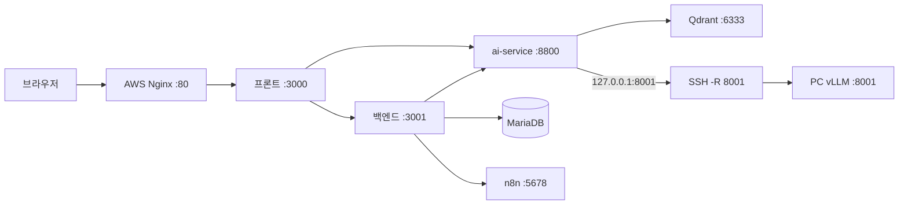

# AWS 앱 서버 + PC vLLM (확정 방향)

최종 갱신: 2026-08-14  
상태: 계획 (미구현)  
관련: [`vllm-setup.md`](../references/vllm-setup.md) · [`documents-watcher-qdrant.md`](../references/documents-watcher-qdrant.md) · [`aws-lightsail-docker.md`](../guides/aws-lightsail-docker.md) · [`2026-08-13-issue-report-n8n.md`](./2026-08-13-issue-report-n8n.md)

AWS **GPU 인스턴스는 쓰지 않는다.** 보안 챗 요약 LLM(vLLM)은 **이 PC**에서만 돌리고, AWS는 앱·DB·n8n·Qdrant만 맡는다.

---

## 결정 요약

| 항목 | 결정 |
|------|------|
| AWS | 프론트 · 백엔드 · ai-service · MariaDB · Docker n8n · Docker Qdrant · Nginx |
| 이 PC | vLLM `:8001` + AWS로의 **역방향 터널**(또는 Tailscale) |
| AWS GPU | **구매하지 않음** |
| 코드 변경 | 기본은 **불필요**. `CHAT_VLLM_BASE_URL`이 서버에서 `http://127.0.0.1:8001/v1` 이면 SSH `-R`로 충분 |
| 보안 챗 클라우드 폴백 | **없음**. PC·vLLM·터널이 꺼지면 요약 실패 |
| vLLM 공인 공개 | **금지** (포트포워드로 8001을 인터넷에 열지 않음) |

---

## 왜 이 구조인가

- AWS GPU(`g4dn`/`g5`)는 시간당 비용이 큼.
- 앱(Node/Python) + Qdrant + n8n + MariaDB는 **CPU 인스턴스**로 충분.
- 기존 코드는 ai-service가 `CHAT_VLLM_BASE_URL`로 **동기 HTTP**를 보내고 답을 기다림. 큐/폴링 신규 개발은 하지 않음.
- 집 PC는 NAT 뒤라 AWS가 `집공인IP:8001`을 그냥 호출할 수 없음 → **PC가 AWS로 접속해 터널을 염**.



---

## 방안 (연결)

**1순위: SSH 역방향 터널** (추가 서비스 없음)

PC(vLLM이 `127.0.0.1:8001`에서 listen)에서:

```bash
ssh -N -R 8001:127.0.0.1:8001 ubuntu@<AWS공인호스트>
```

- AWS 서버의 `127.0.0.1:8001` = 이 PC vLLM.
- 서버 `.env`: `CHAT_VLLM_BASE_URL=http://127.0.0.1:8001/v1` (PC와 동일한 경로 형태).
- `GatewayPorts`는 기본이면 루프백만 열림. **그대로 두는 것이 안전** (인터넷에 8001 안 열림).
- SSH가 끊기면 요약이 죽음 → PC에서 `autossh` 또는 작업 스케줄러로 재접속.

**2순위: Tailscale**  
AWS와 PC가 같은 사설망. 서버 `.env`만 `http://<PC의_Tailscale_IP>:8001/v1`. PC 방화벽은 Tailscale 대역만 허용.

**하지 않음:** 공유기 포트포워드로 vLLM 공개.

---

## AWS 서버 스펙 (GPU 없음)

vLLM·모델 가중치는 PC에 있으므로 AWS 디스크·GPU는 작아도 된다.  
다만 ai-service 보안 RAG **임베드/리랭크는 CPU** (`bge-m3` 등)라 **RAM이 병목**이다.

| 항목 | 권장 | 최소 (빠듯함) |
|------|------|----------------|
| 종류 | Lightsail 또는 EC2 **CPU** (서울 `ap-northeast-2`) | 동일 |
| vCPU | **4** | 2 |
| RAM | **16 GB** | 8 GB (스왑·OOM 위험) |
| 디스크 | **80 GB SSD** | 40 GB |
| GPU | **없음** | 없음 |
| 예 (EC2) | `t3.xlarge` (4 vCPU / 16 GB) | `t3.large` (2 / 8 GB) |
| 예 (Lightsail) | 16 GB 플랜 | 8 GB 플랜 |
| OS | Ubuntu 22.04 LTS | 동일 |

대략 메모리 배분 (16 GB 기준):

| 프로세스 | 대략 |
|----------|------|
| MariaDB | 1 GB |
| n8n | 0.5–1 GB |
| Qdrant | 1–2 GB |
| Node 프론트+백엔드 | 1–2 GB |
| ai-service + CPU 임베드 | **6–10 GB** |
| OS·Nginx | 1 GB |

8 GB는 Qdrant+n8n+앱만 간신히 가능하고, 보안 RAG ingest/질의 때 죽을 수 있어 **16 GB를 기본**으로 한다.

보안 그룹 인바운드: **22 (내 IP), 80, 443**.  
열지 않음: 3000, 3001, 3306, 5678, 6333, 8001, 8800.

---

## 이 PC 스펙·상시 조건

| 항목 | 요구 |
|------|------|
| GPU | 기존 로컬 vLLM과 동일 |
| vLLM | `--host 127.0.0.1 --port 8001` |
| 터널 | 작업 중에는 SSH `-R` 또는 Tailscale 유지 |
| 절전 | 잠자기/종료 시 AWS 보안 요약 불가 |

---

## 서버 `.env` (키만 · 값은 루트 `.env`에서 복사)

| 키 | AWS에서 |
|----|---------|
| `DB_HOST` | `127.0.0.1` (DB를 이 서버에 둘 때) |
| `PORT` | `3001` |
| `AI_SERVICE_URL` | `http://127.0.0.1:8800` |
| `CORS_ORIGIN` | 브라우저가 여는 `http(s)://서버호스트` |
| `N8N_ISSUE_REPORT_WEBHOOK_URL` | `http://127.0.0.1:5678/webhook/issue-report` |
| `QDRANT_URL` | `http://127.0.0.1:6333` |
| `CHAT_VLLM_BASE_URL` | `http://127.0.0.1:8001/v1` (터널) |
| `CHAT_VLLM_MODEL` | PC vLLM served name과 동일 |
| `SECURE_GENERATE` | 요약 쓰려면 `1` |

메일 n8n·Gmail 키는 서버 `.env`에만. Git 금지.

---

## 기동 순서 (운영)

1. AWS: `docker compose up -d` (n8n·Qdrant) → MariaDB → 프론트/백엔드/AI → Nginx  
2. PC: vLLM `:8001` → SSH `-R 8001:...` (또는 Tailscale)  
3. 확인: 서버에서 `curl -s http://127.0.0.1:8001/v1/models` 가 PC 모델을 보면 터널 OK  
4. `/security` 요약 한 번

---

## 의도적으로 하지 않음

- AWS GPU 인스턴스
- vLLM을 `docker-compose.yml`에 넣기
- 집 공인 IP로 vLLM 노출
- 보안 챗 클라우드 폴백
- n8n만 AWS · 백엔드는 PC (메일 콜백 불가)

---

## 다음 구현 시

코드 변경 없이 인프라만으로 가능한지 먼저 검증 (터널 + `curl models`).  
끊김이 잦으면 `autossh`만 추가. Tailscale은 SSH가 번거울 때.
