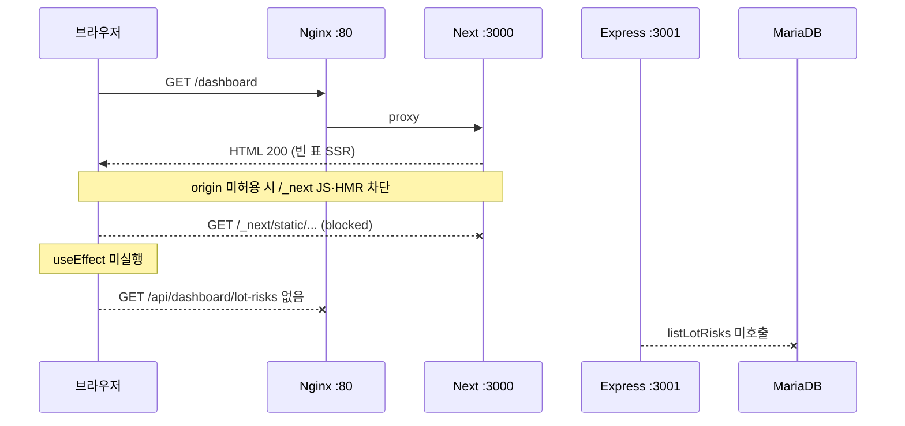
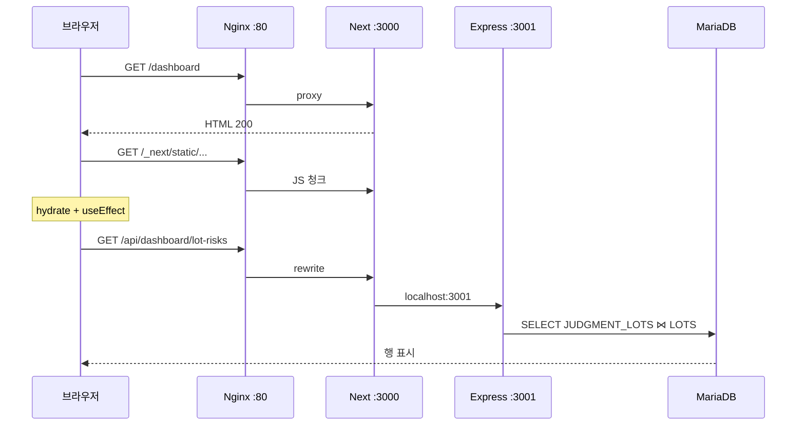

# Lightsail 대시보드 공란 — 원인 분석 · 해결 (2026-08-14)

최종 갱신: 2026-08-14  
대상: 앱 Lightsail(`my-server-16gb`)에서 `npm run dev`로 UI를 열고, 브라우저가 공인 IP(`http://3.38.135.192/dashboard`)로 접속한 경우.

관련: [aws-lightsail-gpu-tunnel.md](../guides/aws-lightsail-gpu-tunnel.md) · Nginx 샘플 [`deploy/nginx-kdt.conf`](../../deploy/nginx-kdt.conf) · 코드 `frontend/next.config.ts`

---

## 1. 결론

대시보드가 비어 보인 것은 **MariaDB에 LOT이 없어서가 아니다.**  
**Next.js 16 `next dev`(Turbopack)가 공인 IP origin의 개발용 자원(`/_next` 청크 · HMR)을 막아, 클라이언트 JS가 실행되지 않은 것**이다.

페이지 HTML은 200으로 내려온다. 표 데이터는 `'use client'` 페이지가 마운트된 뒤 `GET /api/dashboard/lot-risks`로 채운다. JS가 안 뜨면 그 요청이 **한 번도 발생하지 않고**, SSR 빈 표만 남는다.

해결: `frontend/next.config.ts`의 `allowedDevOrigins`에 공인 IP(`3.38.135.192`)를 넣고 `npm run dev`를 재시작했다. 기동 로그에 아래가 보이면 허용된 것이다.

```text
[frontend] allowedDevOrigins=localhost,127.0.0.1,3.38.135.192,172.26.7.3,172.18.0.1
```

---

## 2. 증상

| 항목 | 관측 |
|------|------|
| URL | `http://3.38.135.192/dashboard` (Nginx :80 → Next :3000) |
| UI | 「표시할 LOT 위험등급 데이터가 없습니다.」 · 총 0건 |
| 「최근 업데이트」 | `--:--:--` (클라이언트 fetch 성공 시각이 없음) |
| 브라우저 Network | `GET /dashboard` 200. **`/api/dashboard/lot-risks` 없음** |
| 프론트 터미널 | `GET /dashboard` `GET /main` `GET /issue` 만 200 |
| 백엔드 터미널 | `DEBUG FETCH:` 없음. SPC 폴러만 반복 |
| DB | `DB_HOST=3.36.100.128` `DB_NAME=kdt_project` 로 연결됨. 부트 스코어 `nothing unscored` |

같은 MariaDB를 이 PC에서 보면 LOT이 있다. 서버 HTML만 비어 있었다.

---

## 3. 실제 요청 경로 (오해 지점)

브라우저는 **백엔드 `:3001`을 직접 치지 않는다.** 클라이언트 axios는 상대 경로다.

```text
브라우저
  → http://3.38.135.192/dashboard          Nginx :80
      → Next.js :3000  (HTML + /_next JS)
  → http://3.38.135.192/api/dashboard/...  Nginx :80
      → Next.js :3000  rewrite
          → http://localhost:3001/api/...  Express
              → MariaDB
```

- `frontend/src/api/axios.ts` — `baseURL: '/api'`
- `frontend/next.config.ts` — `/api/:path*` → `http://localhost:3001/api/:path*`
- Grafana iframe만 브라우저가 `NEXT_PUBLIC_GRAFANA_HOST`로 **직접** 연다. 대시보드 LOT 표와 무관.

`NEXT_PUBLIC_*`에 `localhost:3001`을 넣으면 사용자 PC로 요청이 간다. 이번 공란은 그 버그가 아니다. `/api` 상대 경로 자체는 맞았고, **그 fetch가 시작되지 않은 것**이 문제였다.



허용 후:



---

## 4. 원인 (Next.js 16 `allowedDevOrigins`)

Next.js 16 `next dev`는 **개발 전용 자원**에 대한 교차 origin을 기본 차단한다.

- 대상: `/_next/webpack-hmr`, `/_next/static` 청크 등
- 기본 허용: `localhost`, `127.0.0.1`
- 그 외 호스트는 `next.config`의 `allowedDevOrigins`에 호스트명을 넣어야 한다

Lightsail에서 사용자는 `http://3.38.135.192` 로 연다. Next 기동 로그의 Network URL은 **사설 IP**다.

```text
- Local:         http://localhost:3000
- Network:       http://172.26.7.3:3000
```

공인 IP `3.38.135.192`는 Elastic IP / 1:1 NAT라 `os.networkInterfaces()`에 안 나온다. Next가 기본으로 열어 주는 것도 `172.26.7.3`까지다. 브라우저 Origin은 `http://3.38.135.192` 이므로 **교차 origin**으로 분류된다.

관측된 차단 메시지 (재현 시):

```text
Blocked cross-origin request to Next.js dev resource /_next/webpack-hmr from "3.38.135.192".
To allow this host ... allowedDevOrigins: ['3.38.135.192']
```

HTML 문서 요청은 이 가드의 대상이 아니라 `GET /dashboard 200`은 나온다. 하이드 JS만 막히므로 UI는 “연결된 듯한 빈 표”로 남는다.

설정 변경 후 **반드시 `npm run dev` 재시작**. `next.config.ts`는 프로세스 기동 때 한 번 읽는다.

---

## 5. 원인 아님 (로그에 같이 보이던 줄)

같은 터미널에 나와서 DB·AI 문제로 오인하기 쉽다. 대시보드 LOT 표와 무관하다.

| 로그 | 실제 의미 |
|------|-----------|
| `[spc-sync] missing { table: 'SPC_LOT', count: 0 }` 또는 `no new feeder rows (already in LOTS)` | 피더 `SPC_LOT`에서 `LOTS`로 **새로 넣을 행이 0건**. 폴러 정상. 대시보드는 `JUDGMENT_LOTS` ⋈ `LOTS`를 읽음 |
| `[spc-sync-poller] inserted: 0, scored: 0` | 위와 동일. 60초 주기 |
| `CHAT_STORE=sqlite` | 루트 `.env`에 `CHAT_STORE=sqlite`가 **명시**됨. 레거시 챗 스토어. LOT 조회 경로 아님. `node:sqlite` ExperimentalWarning도 이 import |
| `ai_ready=false` / `AI_SERVICE_AUTOSTART=0` | 루트 `npm run dev`가 ai-service를 concurrently로 이미 띄우므로 백엔드 감독은 끈다. uvicorn `:8800`은 떠 있음 |
| `Qdrant collection 'secure_docs' missing` | 보안 RAG ingest 미실행. `/security`만 해당 |
| `boot-score nothing unscored` | 미채점 LOT이 없음. 데이터가 없다는 뜻이 아님 |

---

## 6. 코드 전후

파일: `frontend/next.config.ts`

### 6.1 최초 (공란 재현)

`allowedDevOrigins` **항목 없음**. Next 기본 허용만 적용 → 공인 IP에서 `/_next` 차단.

### 6.2 중간 (CORS env만)

`loadEnvConfig(repoRoot)` 후 `process.env.CORS_ORIGIN` / `CORS_ORIGINS` / `ALLOWED_DEV_ORIGINS`만 파싱해 `localhost` · `127.0.0.1`과 합쳤다.

```ts
allowedDevOrigins: [...new Set(['localhost', '127.0.0.1', ...extraDevOrigins])]
```

이론상 `.env`의 `CORS_ORIGIN=http://3.38.135.192`가 로드되면 충분하다. 실제로는 다음이 겹치면 공인 IP가 빠진다.

- 서버에 이 `next.config`가 아직 없음
- `loadEnvConfig`가 CORS_*를 안 실음 (frontend/.env 선행 로드 등)
- 설정만 바꾸고 **프론트 미재시작**
- 사설 IP(`172.26.7.3`)만 허용되고 공인 IP는 NAT라 목록에 없음

### 6.3 현재 (동작 확인)

허용 호스트를 네 곳에서 모은다.

| 출처 | 역할 |
|------|------|
| `process.env` CORS / `ALLOWED_DEV_ORIGINS` | `.env`가 Next에 로드된 경우 |
| 루트 `.env` 파일 직접 파싱 | `loadEnvConfig` 누락 대비 |
| `os.networkInterfaces()` IPv4 | `172.26.7.3` 등 사설 NIC |
| Lightsail IMDS `public-ipv4` | NAT 뒤 공인 IP (`3.38.135.192`). Windows에서는 생략 |

기동 시 `[frontend] allowedDevOrigins=...` 를 찍어, 공인 IP가 들어갔는지 터미널만으로 확인한다.

`.env.example`에는 서버에서 UI를 공인 IP로 열 때 `CORS_ORIGIN=http://<퍼블릭IP>` (끝 슬래시 없음) 과 필요 시 `ALLOWED_DEV_ORIGINS` 를 적는다.

---

## 7. 같이 넣은 진단 · Nginx

원인 추적용이다. 표에 행을 채운 변경은 `allowedDevOrigins`다.

| 위치 | 내용 |
|------|------|
| `frontend/src/proxy.ts` | 개발에서 `/dashboard` · `/api/*` · HMR · JS 청크 일부에 `[dev-proxy]` 로그 |
| `backend/src/controllers/dashboard.controller.ts` | `[api] GET /api/dashboard/lot-risks?...` |
| `backend/src/services/dashboard.service.ts` | SELECT 직후 `DEBUG FETCH:` |
| 대시보드 빈 칸 | fetch 전(`idle`/`updating`)에는 「LOT 위험 데이터를 불러오는 중입니다.」 |
| `deploy/nginx-kdt.conf` | `/_next/webpack-hmr`만 `Connection "upgrade"`. 전역 upgrade는 HMR 핸드셰이크를 깨뜨림 |

정상 로드 시 터미널에 아래가 **같은 방문에서** 나와야 한다.

```text
[frontend] allowedDevOrigins=...,3.38.135.192,...
[dev-proxy] GET /dashboard host=3.38.135.192 ...
[dev-proxy] GET /api/dashboard/lot-risks ...
[api] GET /api/dashboard/lot-risks?...
DEBUG FETCH: ...
```

`GET /dashboard`만 있고 `/api/dashboard`가 없으면 클라이언트 JS가 여전히 안 뜬 것이다.

---

## 8. 확인된 환경 (재현 당시)

| 항목 | 값 |
|------|------|
| 앱 호스트 | Lightsail Ubuntu, 공인 `3.38.135.192`, 사설 `172.26.7.3` |
| 기동 | 루트 `npm run dev` (`next dev` Turbopack 16.2.12). `next start` 아님 |
| 진입 | Nginx :80 → `127.0.0.1:3000` |
| DB | `DB_HOST=3.36.100.128` `DB_NAME=kdt_project` (원격 MariaDB). 대시보드 SELECT는 여기로 감 |
| 프론트 API | 상대 `/api` → Next rewrite → `localhost:3001` |

운영에서 `next start`(프로덕션 빌드)를 쓰면 HMR·dev origin 가드가 없다. 공인 IP 공란은 **`next dev`를 인터넷 origin으로 열 때**의 문제다. 장기적으로는 Nginx 뒤에서 `next start`가 맞다.

---

## 9. 재발 시 점검 순서

1. 프론트 기동 로그에 `allowedDevOrigins`에 **브라우저 주소창 호스트**(공인 IP)가 있는지.
2. `/dashboard` 방문 후 `[dev-proxy] GET /api/dashboard/lot-risks` 와 `[api] GET` 이 있는지.
3. 없으면 브라우저 콘솔의 `Blocked cross-origin` / HMR websocket 실패.
4. Nginx가 `deploy/nginx-kdt.conf`처럼 HMR만 upgrade 하는지.
5. API가 200인데 표가 0건이면 그때는 DB·대문자 테이블명(`LOTS` / `JUDGMENT_LOTS`, Linux `lower_case_table_names`). 이번 공란의 1차 원인은 여기가 아니었다.

공인 IP가 바뀌면 `.env`의 `CORS_ORIGIN` / `CORS_ORIGINS`를 새 `http://<퍼블릭IP>`로 바꾸고 프론트를 재시작한다. IMDS가 되면 코드가 공인 IP를 추가로 넣는다.
