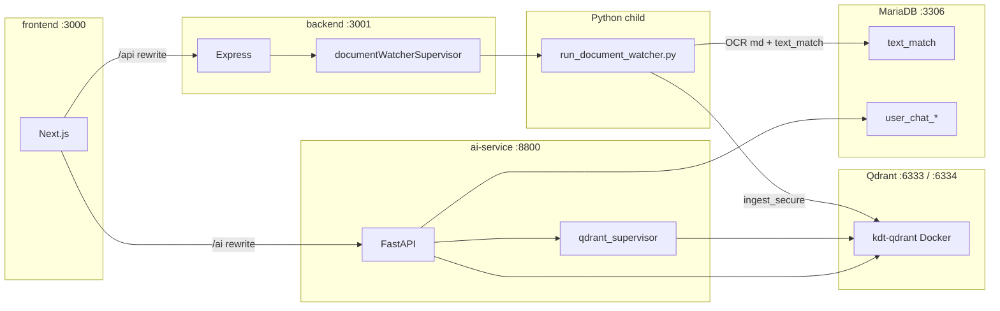

# Documents 워처 · Qdrant 기동 · 포트 (SSOT)

최종 갱신: 2026-08-13

이 문서는 **Documents OCR/`text_match` 워처**와 **Qdrant 자동 기동**, 그리고 모노레포 **포트·프로세스 소유권**을 정리한다.  
일반 챗 페이지 컨텍스트는 [`general-chatbot-page-context.md`](./general-chatbot-page-context.md), 보안 RAG 튜닝은 [`secure-rag.md`](./secure-rag.md).

---

## 1. 한 줄 요약

| 관심사 | 누가 기동하나 | 기본 on/off |
|--------|---------------|-------------|
| Documents 감시 · OCR · `text_match` · ingest 트리거 | **Express backend** 자식 Python | `DOCUMENT_WATCHER_AUTOSTART=1` |
| Qdrant 벡터 DB (:6333) | **ai-service** lifespan (Docker) | `QDRANT_AUTOSTART=1` |
| FastAPI chat/predict/RAG | **ai-service** (:8800) | `npm run dev:ai` 또는 backend `AI_SERVICE_AUTOSTART` |
| OCR/변환 구현 코드 | `ai-service/agent/document_*.py` (로직은 AI 쪽, **프로세스 소유는 backend**) | — |

**Docker가 없으면?**  
→ **Qdrant 자동 기동은 불가**하다. Docker Desktop(또는 `docker` CLI)이 있어야 `kdt-qdrant` 컨테이너를 올린다.  
→ 워처(OCR·md·`text_match`)는 Docker 없이 backend만으로 동작 가능하다. 다만 **ingest(벡터 인덱싱)는 Qdrant가 살아 있어야** 성공한다.

---

## 2. 포트·프로세스 맵



| 포트 | 서비스 | 기동 주체 (권장 `npm run dev`) |
|------|--------|--------------------------------|
| **3000** | Next.js UI | `dev:frontend` |
| **3001** | Express (auth · chat 게이트 · 프록시 · 폴러) | `dev:backend` (`AI_SERVICE_AUTOSTART=0`) |
| **8800** | FastAPI ai-service | `dev:ai` (uvicorn) |
| **6333** | Qdrant HTTP | ai-service `QDRANT_AUTOSTART` → Docker |
| **6334** | Qdrant gRPC | 동일 컨테이너 |
| **8001** | 로컬 vLLM / LM Studio (보안 챗) | **수동** |
| **3306** | MariaDB | 원격/로컬 `.env` `DB_*` |

루트 `npm run dev` = concurrently `ai` + `backend` + `frontend`.  
backend가 ai를 또 띄우지 않도록 [`scripts/dev-backend.cjs`](../../scripts/dev-backend.cjs)가 `AI_SERVICE_AUTOSTART=0`을 넣는다.

---

## 3. Documents 워처 (backend 소유)

### 3.1 왜 backend인가

요청 정책: **backend를 켜면 워처도 같이**.  
OCR·PDF 변환은 Python(`pypdf` / `pymupdf` / Tesseract)이라 구현은 `ai-service`에 두고, **프로세스 수명만 Express가 관리**한다.

### 3.2 파일

| 경로 | 역할 |
|------|------|
| [`backend/src/services/documentWatcherSupervisor.ts`](../../backend/src/services/documentWatcherSupervisor.ts) | `python scripts/run_document_watcher.py` spawn |
| [`backend/src/index.ts`](../../backend/src/index.ts) | listen 직후 `startDocumentWatcherSupervisor()` |
| [`ai-service/scripts/run_document_watcher.py`](../../ai-service/scripts/run_document_watcher.py) | 워처 데몬 (SIGINT/SIGTERM 대기) |
| [`ai-service/agent/document_watcher.py`](../../ai-service/agent/document_watcher.py) | watchdog 이벤트 · debounce · ingest coalesce |
| [`ai-service/agent/document_convert.py`](../../ai-service/agent/document_convert.py) | 네이티브 텍스트 판정 · OCR · md · `text_match` |
| [`ai-service/agent/text_match_store.py`](../../ai-service/agent/text_match_store.py) | MariaDB `text_match` CRUD |

FastAPI lifespan에서는 **더 이상 워처를 시작하지 않는다** ([`ai-service/app/main.py`](../../ai-service/app/main.py)).

### 3.3 환경 변수

| 변수 | 기본 | 의미 |
|------|------|------|
| `DOCUMENT_WATCHER_AUTOSTART` | `1` | backend가 데몬을 띄울지 |
| `SECURE_DOCS_WATCH` | 데몬이 `1`로 강제 | 워처 내부 enable |
| `SECURE_DOCS_WATCH_DEBOUNCE` | `4.0` | 파일 안정화 후 처리 지연(초) |
| `AI_SERVICE_CWD` | `…/ai-service` | Python cwd |
| `AI_SERVICE_PYTHON` / `TESSERACT_CMD` | (선택) | 인터프리터 · Tesseract 경로 |

끄기: 루트 `.env` 또는 backend 환경에 `DOCUMENT_WATCHER_AUTOSTART=0`.

### 3.4 동작 요약 (파일 드롭 시)

1. `Documents/<Clearance>/`에 pdf/txt/이미지 추가·변경  
2. debounce 후 `convert_file_to_md`  
   - **네이티브 텍스트 충분** → md 매칭 **안 만듦**, 원본 ingest 대상  
   - **비어 있음(스캔/이미지)** → OCR → `Markdown/<stem>.md` + `text_match` upsert  
3. 변경 있으면 `ingest_secure.run_ingest()` (Qdrant 필요) → 가능하면 BM25 핫리로드  
4. 원본 삭제 시 sidecar md + `text_match` 행 정리

정책 상세: [`Documents/README.md`](../../Documents/README.md).

### 3.5 Docker 없이도 되는 것 / 안 되는 것

| 단계 | Docker 필요? |
|------|----------------|
| 워처 기동 (backend) | 아니오 |
| OCR → `.md` 작성 | 아니오 (Tesseract + pip 패키지) |
| `text_match` MariaDB 기록 | 아니오 (DB만) |
| `ingest_secure` → Qdrant 인덱싱 | **예 — Qdrant 프로세스 필요** (자동 기동은 Docker) |

---

## 4. Qdrant (ai-service 소유)

### 4.1 자동 기동

[`ai-service/agent/qdrant_supervisor.py`](../../ai-service/agent/qdrant_supervisor.py)

1. `GET {QDRANT_URL}/readyz` 성공이면 종료  
2. `QDRANT_AUTOSTART=1`이면 Docker로  
   - 기존 컨테이너 `kdt-qdrant` 있으면 `docker start`  
   - 없으면 `docker run -d --name kdt-qdrant -p 6333:6333 -p 6334:6334 -v <storage>:/qdrant/storage qdrant/qdrant`  
3. ready 될 때까지 대기 (`QDRANT_READY_MS`, 기본 60s)

스토리지 기본 경로: **`DB/data/qdrant_storage/`** (git ignore).  
ai-service 종료 시 **Qdrant 컨테이너는 내리지 않는다** (다른 도구와 공유).

### 4.2 환경 변수

| 변수 | 기본 | 의미 |
|------|------|------|
| `QDRANT_AUTOSTART` | `1` | lifespan 자동 기동 |
| `QDRANT_URL` | `http://127.0.0.1:6333` | 클라이언트 URL |
| `QDRANT_STORAGE_DIR` | `DB/data/qdrant_storage` | 볼륨 호스트 경로 |
| `QDRANT_IMAGE` | `qdrant/qdrant` | 이미지 |
| `QDRANT_HTTP_PORT` / `QDRANT_GRPC_PORT` | `6333` / `6334` | 호스트 포트 |
| `QDRANT_READY_MS` | `60000` | ready 대기 |

### 4.3 “도커가 없어서 지금 불가”의 정확한 의미

| 상황 | 결과 |
|------|------|
| Docker Desktop **미실행** / `docker` CLI 실패 | `ensure_qdrant()` 실패 로그. **자동으로 :6333을 못 올림** |
| Docker 없이 Qdrant **바이너리·다른 호스트**를 이미 띄움 | `QDRANT_AUTOSTART=0`, `QDRANT_URL`만 맞으면 RAG/ingest **가능** (자동 기동만 스킵) |
| Docker는 있으나 이미지 pull 실패·포트 점유 | 로그 확인 후 `docker start kdt-qdrant` 또는 수동 `docker run …` |

즉 **“Docker 없으면 RAG가 원리상 불가능”이 아니라**,  
**현재 구현한 자동 기동 경로가 Docker 전용**이라, Docker가 없으면 **별도로 Qdrant를 미리 켜 두지 않는 한** ingest/보안 RAG가 막힌다.

수동 예시:

```bash
docker run -d --name kdt-qdrant -p 6333:6333 -p 6334:6334 ^
  -v "%CD%/DB/data/qdrant_storage:/qdrant/storage" qdrant/qdrant
```

그다음:

```bash
cd ai-service
python ingest_secure.py
```

---

## 5. 권장 기동 순서

1. **Docker Desktop 실행** (Qdrant 자동기동용)  
2. 루트 `npm run dev`  
   - ai → Qdrant ensure → uvicorn :8800  
   - backend → document watcher 자식 → Express :3001  
   - frontend :3000  
3. (최초/정리 후) 필요 시 `cd ai-service && python ingest_secure.py`  
4. 보안 챗 LLM이 필요하면 :8001 수동

Tesseract(Windows): `winget install UB-Mannheim.TesseractOCR`,  
`kor` 언어팩은 `%LOCALAPPDATA%\tesseract-tessdata\tessdata\` (Program Files 쓰기 권한 이슈 회피).  
선택: `TESSERACT_CMD=C:\Program Files\Tesseract-OCR\tesseract.exe`.

MariaDB `text_match`: [`DB/text_match.sql`](../../DB/text_match.sql) · `python DB/ai-service/apply_text_match.py`.

---

## 6. 장애 체크리스트

| 증상 | 확인 |
|------|------|
| `[qdrant] Docker not on PATH` / ensure_ok=False | Docker Desktop 실행 · PATH |
| ingest `ConnectError :6333` | Qdrant ready · `curl http://127.0.0.1:6333/readyz` |
| `[doc-watcher] script not found` | `AI_SERVICE_CWD` · ai-service 경로 |
| OCR fail / no kor | Tesseract · tessdata · `TESSERACT_CMD` |
| `[text_match] DB unavailable` | 루트 `.env` `DB_*` / `DATABASE_URL` |
| `:8800` EADDRINUSE | `dev:ai`와 backend `AI_SERVICE_AUTOSTART=1` 이중 기동 여부 |

---

## 7. 관련 링크

- [`Documents/README.md`](../../Documents/README.md) — 변환 정책  
- [`secure-rag.md`](./secure-rag.md) — RAG · ingest · 환경  
- [`general-chatbot-page-context.md`](./general-chatbot-page-context.md) — 일반 챗 페이지 컨텍스트  
- DDL: [`DB/text_match.sql`](../../DB/text_match.sql) · [`DB/schema.sql`](../../DB/schema.sql)
