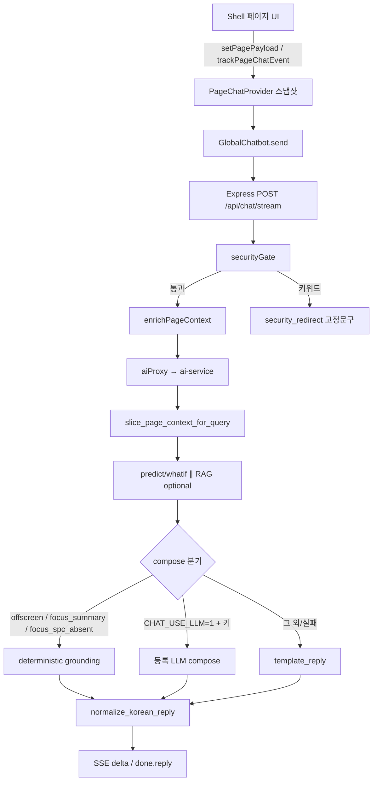

# 일반 챗봇 — 응답 방식 · 페이지 참조 로직 (SSOT)

최종 갱신: 2026-08-18

**범위:** 셸 `GlobalChatbot` → `POST /api/chat` · `/api/chat/stream` → ai-service `/chat` · `/chat/stream`  
**제외:** 보안 오버레이(`SecurityChatbot`, `/security-chat`) — 별도 [`security-chatbot-guide.md`](./security-chatbot-guide.md)

이 파일이 일반 챗 페이지 컨텍스트 SSOT다.

---

## 1. 한눈에 보는 파이프라인



**사실 우선순위 (인용 근거):**  
`focusPayload` → `pagePayload` → BE `supplement`

---

## 2. 프론트엔드 — 페이지를 어떻게 “참조”하는가

### 2.1 핵심 모듈

| 파일 | 역할 |
|------|------|
| [`frontend/src/context/PageChatContext.tsx`](../../frontend/src/context/PageChatContext.tsx) | 화면 스냅샷 저장소 |
| [`frontend/src/components/layout/AppShell.tsx`](../../frontend/src/components/layout/AppShell.tsx) | `PageChatProvider` · 라우트 리셋 · `GlobalChatbot` 마운트 |
| [`frontend/src/components/chat/GlobalChatbot.tsx`](../../frontend/src/components/chat/GlobalChatbot.tsx) | 전송 시 `page_context` 부착 · 스트림 말풍선 |
| [`frontend/src/api/aiApi.ts`](../../frontend/src/api/aiApi.ts) | `postChatStream` / `PageChatContextRequest` |

### 2.2 스냅샷 필드

```ts
type PageChatContextPayload = {
  route: string
  focusId?: string | null      // 보통 entityId(LOT ID 등), 없으면 target 이름
  focusPayload?: unknown       // 클릭/선택 행의 요약 JSON (최대 ~8000자 truncate)
  pagePayload?: unknown        // 현재 화면 목록·필터·탭 요약
  supplementHints?: string[]   // BE 보충용 힌트 (risk-top, inquiry …)
}
```

### 2.3 API 동작

| API | 동작 |
|-----|------|
| `setPagePayload(route, summary, hints?)` | 화면 요약·힌트 갱신. JSON 길면 truncate |
| `trackPageChatEvent({ type, route?, target, entityId?, payload? })` | F12 `console.info('[page-chat-event]')`. `clear`가 아니면 `focusId = entityId \|\| target`, `focusPayload` 설정 |
| `resetForRoute(pathname)` | 네비게이션 시 focus·pagePayload·hints 전부 비움 (페이지 간 오염 방지) |
| `getChatPageContext()` | 전송 직전 스냅샷. `[page-chat] attach` 로그 |

이벤트 타입: `row_click` · `row_select` · `filter_apply` · `panel_open` · `kpi_click` · `download` · `clear`  
목록 상한 상수: `PAGE_CHAT_LIST_LIMIT = 10` (UI 칩 없음 — 콘솔만)

### 2.4 전송 페이로드 (`GlobalChatbot`)

```ts
postChatStream({
  message,
  features?,           // 진단/what-if 공정값 (있을 때만)
  llm_mode,            // 'auto' | vault credential id
  page_context: {
    route, focusId, focusPayload, pagePayload, supplementHints
  },
  enable_api_llm: Boolean(features) || undefined, // 레거시 힌트
})
```

스트림 `done` 시 **정규화된 `data.reply`로 말풍선을 확정 치환** (raw delta fallback은 reply 없을 때만).

### 2.5 페이지별 주입 내용

| 라우트 | 파일 | pagePayload 요지 | supplementHints | focus |
|--------|------|------------------|-----------------|-------|
| `/main` | `app/(shell)/main/page.tsx` | `riskTop`(≤10), `dailyKpi`, `qCost`, `selectedLotId` | `risk-top`, `daily-kpi`, `q-cost` | 위험 LOT 클릭/상세 (`spcGraph`), Q-Cost download, clear |
| `/dashboard` | `…/dashboard/page.tsx` | `lotRisks`(≤10), `selectedLot`, 추이·FI·일별·탭 | `dashboard-lot-risks`, `dashboard-trend`, `dashboard-fi` | LOT 행 선택 (`spcGraph: none\|present`), clear |
| `/knowledge` | `…/knowledge/page.tsx` | `activeTab`, `visibleTables`, 필터, past/handover(≤10), 문서 메타, selection | `handover`, `documents` | 과거이슈·인수인계·문서 클릭 |
| `/inquiry` | `…/inquiry/page.tsx` | 필터·건수·문의 목록(≤10)·selection | `inquiry` | 문의 행 select / clear |
| `/management` | `…/management/page.tsx` | 패널·날짜·확장·Grafana 노트 | `spc` | panel_open / 날짜 filter / clear |
| `/setting` | `…/setting/page.tsx` | 폰트·테마·새로고침·알림·섹션 (**API 키 값 미포함**) | `setting` | 없음 (페이지 요약만) |
| `/issue` | `…/issue/page.tsx` | 필터·이슈(≤15)·selected | `issues` | 이슈 행 select / clear |

라우트 변경 시 `AppShell`의 `PageChatRouteReset`이 `resetForRoute`를 호출해 **이전 화면 focus/목록이 새 페이지로 새지 않음**.

---

## 3. 백엔드 — 중계 · 보충 · 게이트

### 3.1 모듈

| 파일 | 역할 |
|------|------|
| [`backend/src/routes/chat.ts`](../../backend/src/routes/chat.ts) | `/api/chat`, `/api/chat/stream`, `prepareChatContext` |
| [`backend/src/services/pageChatContext.service.ts`](../../backend/src/services/pageChatContext.service.ts) | `enrichPageContext` |
| [`backend/src/services/aiProxy.ts`](../../backend/src/services/aiProxy.ts) | ai-service 프록시 (camel → snake) |
| [`backend/src/services/securityGate.ts`](../../backend/src/services/securityGate.ts) | 보안 키워드 → AI 미호출 |

### 3.2 `enrichPageContext`

1. FE `pagePayload`가 **얇음**(`null` / `{}` / 40자 미만)이고  
2. 라우트가 `/knowledge` · `/inquiry` · `/setting`이 **아니면**  
→ allowlist 보충(`supplement`) fetch.

| 조건 | 보충 내용 |
|------|-----------|
| `/main` + hints | `riskTop` 상위 5, `dailyKpi`, `qCost` |
| `/dashboard` | `lotRisks` 상위 5 |
| `/issue` | 오픈 이슈 상위 5 |
| hint `past-issues` | 과거 이슈 상위 5 |
| `/management` | `{ note, route }`만 (시계열 덤프 없음) |

knowledge / inquiry / setting은 **보충 금지** (다른 화면 LOT·인수인계 오염 방지).

페이로드 truncate 상한 ≈ **6000자**. 로그: `[page-chat] enrich`, 채팅 시 `[page-chat-event]`(route/focusId/hasFocus…).

### 3.3 ai-service로 넘기는 형태

```json
{
  "message": "...",
  "thread_id": "...",
  "user_id": "...",
  "features": { },
  "llm_mode": "auto",
  "llm_credentials": [ ],
  "enable_api_llm": true/false,
  "page_context": {
    "route": "/dashboard",
    "focus_id": "LOT-...",
    "focus_payload": { },
    "page_payload": { },
    "supplement": { },
    "supplement_hints": ["dashboard-lot-risks"]
  }
}
```

보안 키워드 히트 시: `mode: security_redirect`, AI 프록시 없음.

---

## 4. AI 서비스 — 답변을 만드는 로직

### 4.1 모듈

| 파일 | 역할 |
|------|------|
| [`ai-service/app/schemas.py`](../../ai-service/app/schemas.py) | `PageContextModel`, `ChatRequest` |
| [`ai-service/app/main.py`](../../ai-service/app/main.py) | `/chat`, `/chat/stream`, history·topic_shift |
| [`ai-service/agent/api_llm/grounding.py`](../../ai-service/agent/api_llm/grounding.py) | slice · focus · offscreen · deterministic · normalize · grounding |
| [`ai-service/agent/api_llm/graph.py`](../../ai-service/agent/api_llm/graph.py) | `run_chat` / `iter_chat_events` / `compose_bundle` |
| [`ai-service/agent/api_llm/llm.py`](../../ai-service/agent/api_llm/llm.py) | LLM compose · stream |
| [`ai-service/agent/api_llm/prompts.py`](../../ai-service/agent/api_llm/prompts.py) | `SYSTEM_COMPOSE` |

### 4.2 답변 결정 순서 (엄수)

1. **(BE)** 보안 게이트 → 해당 시 종료.  
2. **히스토리:** `detect_topic_shift`면 히스토리 축소. 히스토리는 말투·대명사만 — **수치 사실 금지**.  
3. **`slice_page_context_for_query(message, page_context)`**  
   1. `visible_ui_for_route`  
   2. **offscreen**이면 focus 제거 + `empty_hint` + `primary_table=offscreen` → 종료  
   3. **`should_prefer_focus`**이면  
      - 「지금 로트 / 이거 뭐야」→ `focus_summary` + DB 필드 공백 요약 (deterministic)  
      - SPC 질문 + 그래프 없음 → `focus_spc_absent` (deterministic)  
      - 그 외 → `primary_table=focus`, 목록 omit  
   4. 아니면 라우트별 페이지 슬라이스 (knowledge both/handover/past, inquiry, main qCost/KPI/riskTop …)  
4. **features:** FE가 준 값 우선. 없으면 진단 intent일 때만 page/focus에서 추출.  
5. **RAG:** 문서·분석 intent regex일 때만 (화면/LOT 질문이면 스킵). Public+Confidential, light top_k.  
6. **predict/whatif:** features 있을 때 registry 헤드.  
7. **compose**  
   - deterministic (`offscreen` / `focus_summary` / `focus_spc_absent`) → LLM **스킵**, `provider=grounding`  
   - `CHAT_USE_LLM=1` + vault 키 → LLM  
   - 그 외/실패 → `_template_reply`  
8. what-if / capacity / residual 블록 필요 시 덧붙임.  
9. 항상 **`normalize_korean_reply`**.

### 4.3 focus를 쓰는가 (`should_prefer_focus`)

- **유지:** 「이거 / 이 로트 / 방금 클릭」 등 deixis, 또는 목록 질문이 아닌 일반 질문 + focus 존재  
- **이탈:** 「그건 말고」, 메시지 LOT와 focus LOT가 서로소, 「이 화면·목록·몇 건·KPI·Q-COST·설정·문의 게시판」 등 **목록성** 질문(deixis 없을 때)

### 4.4 확정 답 (LLM 없이)

| `primary_table` | 언제 | 내용 |
|-----------------|------|------|
| `offscreen` | 현재 화면에 없는 UI를 물을 때 | 보이는 UI + 이동 경로만 (예: knowledge에서 문의 → `/inquiry`) |
| `focus_summary` | 「지금 로트 이거 뭐야」+ focus | lotId·불량확률·잔류·여유·등급·SPC를 **공백 있는 문장**으로 |
| `focus_spc_absent` | 「SPC 그래프 없어」+ spc `-`/없음 | 해당 LOT만, 목록 나열 없음 |

### 4.5 LLM이 받아 쓰는 근거 (`build_grounding` + `SYSTEM_COMPOSE`)

시스템 프롬프트는 **긍정 지시**(존댓말·지금 화면 JSON만)로 둔다. 「하지 마세요」 나열은 모델이 그대로 읽히므로 프롬프트에 넣지 않고, 화면 안내 문장 잔여는 `normalize_korean_reply`가 걷는다.

**인용 가능**

- slice 이후 `focus_payload` / `page_payload` / `supplement`
- `visible_ui`, `empty_answer_hint`, `allowed_metric_keys`
- predict / capacity / residual / recommendation (있을 때만)
- `rag_sources` (검색됐을 때만). 일반 챗 RAG는 `Documents/` **Public · Confidential**만. Secret·TopSecret은 보안 챗.

**금지**

- `visible_ui`에 없는 탭·메뉴·버튼·건수 창작  
- 사용자 답에 「현재 화면은 ○○만 보입니다」 / 「보이는 것은 …뿐입니다」  
- 없는 탭이 「활성」이라고 단정  
- allowlist에 없는 LOT/%/ppm 창작  
- 이전 턴 LOT/%를 현재 화면과 무관하게 재인용  
- 시스템 규칙 문장(「말하지 마세요」)을 사용자 답에 출력  
- 장비 즉시 반영 주장  

### 4.6 라우트 → 기본 `visible_ui`

FE `pagePayload.visibleTables`가 있으면 그걸 우선.

| 라우트 | label | 기본 visible_ui |
|--------|-------|-----------------|
| `/knowledge` | knowledge | 과거자료, 인수인계, 사내문서 (+ activeTab) |
| `/inquiry` | inquiry | 문의목록, 필터, 선택문의 |
| `/main` | main | 위험LOT, 일일KPI, Q-COST |
| `/dashboard` | dashboard | LOT위험, 생산추이, 상세패널 |
| `/issue` | issue | 이슈목록, 이슈상세 |
| `/management` | spc | SPC패널(Grafana), 날짜필터 |
| `/setting` | setting | 폰트, 테마, 새로고침, 알림, API키설정 |

**오프스크린 예시**

사용자에게 화면 목록을 읽혀 주지 않는다. 경로만 안내.

- knowledge + 「문의」→ `/inquiry` 안내 (문의 탭 없음)  
- knowledge + 「설정」→ `/setting`  
- knowledge + 「SPC」→ `/management`  
- 비-inquiry + 「문의 내역/목록」→ `/inquiry`

### 4.7 한국어 정규화 (`normalize_korean_reply`)

전면 교체 규칙 (2026-08-13):

1. 규칙 에코 문구 제거  
2. 「현재 화면은 …만 보입니다」 / 「보이는 것은 …뿐입니다」 제거  
3. **한글 ↔ 영문·숫자·괄호·특수문자** 경계에 공백 1칸 (숫자↔영문 예: `3071 ppm`)  
4. **줄바꿈은 `다.` / `요.` 뒤에만** (일반 `.`·`8.3`은 개행 없음)  
5. 거의 동일 문장 dedupe  

청크·DB 필드 조립은 `join_spaced_parts`로 조각마다 공백.

### 4.8 스트림 이벤트

```
meta (start) → meta (context_ready) → delta* → done { reply, mode, provider, predict, timing, … }
```

deterministic이면 delta 한 번에 확정 문구 + `provider: grounding`.

---

## 5. 사용자 질문 유형별 동작 예

| 화면 | 질문 | 기대 경로 |
|------|------|-----------|
| Dashboard, LOT 클릭됨 | 「지금 로트 이거 뭐야」 | `focus_summary` 확정 답 (LLM 스킵) |
| Dashboard, SPC `-` | 「이 로트는 왜 SPC 그래프가 없어?」 | `focus_spc_absent` 확정 답 |
| Knowledge | 「문의 내역이 안 보여」 | `offscreen` → `/inquiry` 안내 |
| Main | 「위험 LOT 몇 건」 | focus 이탈 → page `riskTop` 집계 |
| 임의 + 문서 분석 요청 | 「SOP 찾아줘」 | RAG ON + (선택) LLM |
| 공정값 features 첨부 | 「불량 진단해줘」 | predict 헤드 + compose |

---

## 6. 저장 · 멀티턴

| 저장소 | 내용 |
|--------|------|
| Express `chatStore` | 세션 메시지 (user/assistant 텍스트) |
| ai-service MariaDB `user_chat_*` | `thread_id`+`user_id` 있을 때 일반 채널 멀티턴 |

FE는 **히스토리 배열을 보내지 않음** — `message` + `thread_id` + `user_id` + `page_context`만. 서버가 DB에서 문맥을 읽음.

focus 이벤트 자체는 **DB analytics 미저장** (F12/BE 구조화 로그만).

---

## 7. 환경 · 운영 메모

| 항목 | 값 |
|------|-----|
| FE | `:3000` |
| Express | `:3001` |
| ai-service | `:8800` (`AI_SERVICE_URL`) |
| LLM | `CHAT_USE_LLM=1` + 설정 페이지 vault 키 |
| RAG | Public+Confidential · 일반 챗 light top_k |
| 동시 기동 | 루트 `npm run dev` — AI는 `dev:ai`만 포트 소유 (`AI_SERVICE_AUTOSTART=0` on backend) |

---

## 8. 파일 인덱스

```
frontend/src/context/PageChatContext.tsx
frontend/src/components/layout/AppShell.tsx
frontend/src/components/chat/GlobalChatbot.tsx
frontend/src/api/aiApi.ts
frontend/src/app/(shell)/{main,dashboard,knowledge,inquiry,management,setting,issue}/page.tsx

backend/src/routes/chat.ts
backend/src/services/pageChatContext.service.ts
backend/src/services/aiProxy.ts
backend/src/services/securityGate.ts

ai-service/app/schemas.py
ai-service/app/main.py
ai-service/agent/api_llm/grounding.py
ai-service/agent/api_llm/graph.py
ai-service/agent/api_llm/llm.py
ai-service/agent/api_llm/prompts.py
```

이 문서가 **일반 챗봇의 페이지 참조·응답 로직 SSOT**이다. 세부 튜닝·보안 RAG는 상단 링크의 LLM 튜닝·보안 가이드를 본다.
