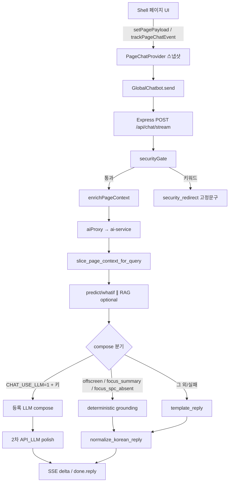

# 일반 챗봇 — 응답 방식 · 페이지 참조 로직 (SSOT)

최종 갱신: 2026-08-19

**범위:** 셸 `GlobalChatbot` → `POST /api/chat` · `/api/chat/stream` → ai-service `/chat` · `/chat/stream`  
**제외:** 보안 오버레이(`SecurityChatbot`, `/security-chat`) — 별도 [`security-chatbot-guide.md`](./security-chatbot-guide.md)

이 파일이 일반 챗 페이지 컨텍스트 SSOT다.

---

## 1. 한눈에 보는 파이프라인



**사실 우선순위 (인용 근거):**  
`focusPayload` → `pagePayload` (현재 화면 필터로 그 페이지 API만 재조회한 값)  
다른 페이지 행·`supplement` 교차 없음.  
매 턴 **페이지 ∩ 이벤트** (`route` + `pagePayload` + `lastEvent`). XOR로 한쪽만 쓰지 않는다.

---

## 2. 프론트엔드 — 페이지를 어떻게 “참조”하는가

### 2.1 핵심 모듈

| 파일 | 역할 |
|------|------|
| [`frontend/src/context/PageChatContext.tsx`](../../frontend/src/context/PageChatContext.tsx) | 화면 스냅샷 저장소 |
| [`frontend/src/components/layout/AppShell.tsx`](../../frontend/src/components/layout/AppShell.tsx) | `PageChatProvider` · 라우트 리셋 · `GlobalChatbot` 마운트 |
| [`frontend/src/components/chat/GlobalChatbot.tsx`](../../frontend/src/components/chat/GlobalChatbot.tsx) | 전송 시 `page_context` 부착 · 스트림 말풍선 |
| [`frontend/src/api/aiApi.ts`](../../frontend/src/api/aiApi.ts) | `postChatStream` / `PageChatContextRequest` |

### 2.2 스냅샷 필드

```ts
type PageChatLastEvent = {
  type: PageChatEventType
  target: string
  entityId?: string | null
  ts: string
}

type PageChatContextPayload = {
  route: string
  focusId?: string | null      // 보통 entityId(LOT ID 등), 없으면 target 이름
  focusPayload?: unknown       // 클릭/선택 행의 요약 JSON (최대 ~8000자 truncate)
  pagePayload?: unknown        // 현재 화면 목록·필터·탭 요약
  lastEvent?: PageChatLastEvent | null  // 방금 UI 동작 (페이지와 함께 매 턴 전송)
  supplementHints?: string[]   // 전송 필드는 유지. hydrate는 route+화면 필터만 사용 (힌트 OR 없음)
}
```

페이지와 이벤트는 **한 턴에 함께** 간다. 클릭이 있어도 `pagePayload`를 버리지 않는다.

### 2.3 API 동작

| API | 동작 |
|-----|------|
| `setPagePayload(route, summary, hints?)` | 화면 요약·힌트 갱신. lastEvent/focus는 유지. JSON 길면 truncate |
| `trackPageChatEvent({ type, route?, target, entityId?, payload? })` | F12 `console.info('[page-chat-event]')`. `clear`가 아니면 `focus`와 `lastEvent`를 같이 기록. `clear`는 focus/lastEvent만 비우고 **pagePayload는 유지** |
| `resetForRoute(pathname)` | 네비게이션 시 `route=pathname` 즉시. focus·lastEvent·pagePayload 비움 (이전 화면 목록 오염 방지) |
| `getChatPageContext()` | 전송 직전 스냅샷. `[page-chat] attach` 로그 |

이벤트 타입: `row_click` · `row_select` · `filter_apply` · `panel_open` · `kpi_click` · `download` · `clear`  
목록 상한 상수: `PAGE_CHAT_LIST_LIMIT = 10` (UI 칩 없음 — 콘솔만)

### 2.4 전송 페이로드 (`GlobalChatbot`)

```ts
postChatStream({
  message,
  features?,           // 진단/what-if 공정값 (있을 때만)
  llm_mode,            // 'auto' | vault credential id
  page_context: {
    route,             // usePathname()이 SSOT (스냅샷 route가 '/'여도 URL 우선)
    focusId, focusPayload, pagePayload, lastEvent, supplementHints
  },
  enable_api_llm: Boolean(features) || undefined, // 레거시 힌트
})
```

스트림 `done` 시 **정규화된 `data.reply`로 말풍선을 확정 치환** (raw delta fallback은 reply 없을 때만).

### 2.5 페이지별 주입 내용

| 라우트 | 파일 | pagePayload 요지 | supplementHints | focus |
|--------|------|------------------|-----------------|-------|
| `/main` | `app/(shell)/main/page.tsx` | `riskTop`(≤10), `dailyKpi`, `qCost`, `selectedLotId` | `risk-top`, `daily-kpi`, `q-cost` | 위험 LOT 클릭/상세 (`spcGraph`), Q-Cost download, clear |
| `/dashboard` | `…/dashboard/page.tsx` | `lotRisks`(≤10), `selectedLot`, 추이·FI·일별·탭 | `dashboard-lot-risks`, `dashboard-trend`, `dashboard-fi` | LOT 행 선택 (`spcGraph: none\|present`), clear |
| `/knowledge` | `…/knowledge/page.tsx` | `activeTab`, `visibleTables`, 필터, past/handover(≤10), 문서 메타, selection | `handover`, `documents` | 과거이슈·인수인계·문서 클릭 |
| `/inquiry` | `…/inquiry/page.tsx` | 필터·건수·문의 목록(≤10)·selection | `inquiry` | 문의 행 select / clear |
| `/management` | `…/management/page.tsx` | 패널·날짜·확장·Grafana 노트 | `spc` | panel_open / 날짜 filter / clear |
| `/setting` | `…/setting/page.tsx` | 폰트·테마·새로고침·알림·섹션 (**API 키 값 미포함**) | `setting` | 없음 (페이지 요약만) |
| `/issue` | `…/issue/page.tsx` | 필터·이슈(≤15)·selected | `issues` | 이슈 행 select / clear |

라우트 변경 시 `AppShell`의 `PageChatRouteReset`이 **첫 마운트와 경로 변경**에서 `resetForRoute`를 호출한다. `/security` 오버레이 출입은 스냅샷을 지우지 않는다.

---

## 3. 백엔드 — 중계 · hydrate · 게이트

### 3.1 모듈

| 파일 | 역할 |
|------|------|
| [`backend/src/routes/chat.ts`](../../backend/src/routes/chat.ts) | `/api/chat`, `/api/chat/stream`, `prepareChatContext` |
| [`backend/src/services/pageChatContext.service.ts`](../../backend/src/services/pageChatContext.service.ts) | `enrichPageContext` |
| [`backend/src/services/aiProxy.ts`](../../backend/src/services/aiProxy.ts) | ai-service 프록시 (camel → snake) |
| [`backend/src/services/securityGate.ts`](../../backend/src/services/securityGate.ts) | 보안 키워드 → AI 미호출 |

### 3.2 `enrichPageContext`

무필터 top-5 보충·힌트 OR·다른 화면 `supplement`는 **쓰지 않는다.** `supplement`는 항상 `null`.

`pagePayload`가 있으면 **현재 `route`의 서비스만**, FE가 실어 준 화면 필터로 DB를 다시 읽고 목록·건수를 그 결과로 덮는다. 값은 DB에 적힌 그대로다. 대시보드와 이슈는 같은 `JUDGMENT_LOTS`/`ANALYSIS_LOTS`여도 **서로 행을 가져오지 않는다.**

`pagePayload`가 아직 없으면(이동 직후, 얇은 `null`/`{}`) **무필터 목록을 채우지 않는다.** route만 두고 끝.

| route | DB 호출 | 필터 |
|-------|---------|------|
| `/dashboard` | `dashboardService.listLotRisks` | `pagePayload.lotRisks.filter` → FE `lotRiskListParams`와 동일 (search, min/maxProb, marginLevel, residualLevel, riskLevel, spc, page) |
| `/issue` | `issueService.listOpenIssues` | `pagePayload.filters`의 search·date·lot·risk. API에 없는 spc는 조회 후 화면 필터로 한 번 더 걸러 **화면에 뜬 이슈만**. 담당(assignment)은 목록 API에 없어 화면 페이지 행에 DB 값을 덮고 건수는 화면 `totalOpen`을 유지 |
| `/main` | `getRiskTop` + `getDailyProbabilityKpi` + `getQCostSummary` | Main 전용. lotRisks/issues 금지 |
| knowledge / inquiry / setting / management | 재조회 없음 | 화면 JSON만 |

focus가 LOT/이슈면 **같은 라우트 상세만** 숫자 교체 (`getLotRiskDetail` / `getIssueById` / Main은 `getLotById`). 대시보드에서 이슈 상세를 치지 않음.

페이로드 truncate 상한 ≈ **6000자**. 로그: `[page-chat] enrich`, 채팅 시 `[page-chat-event]`(route/focusId/hasFocus…).

### 3.3 ai-service로 넘기는 형태

```json
{
  "message": "...",
  "thread_id": "...",
  "user_id": "...",
  "features": { },
  "llm_mode": "auto",
  "llm_credentials": [ ],
  "enable_api_llm": true/false,
  "page_context": {
    "route": "/dashboard",
    "focus_id": "LOT-...",
    "focus_payload": { },
    "page_payload": { },
    "last_event": { "type": "row_select", "target": "lot-row", "entity_id": "LOT-..." },
    "supplement": null,
    "supplement_hints": ["dashboard-lot-risks"]
  }
}
```

보안 키워드 히트 시: `mode: security_redirect`, AI 프록시 없음.

---

## 4. AI 서비스 — 답변을 만드는 로직

### 4.1 모듈

| 파일 | 역할 |
|------|------|
| [`ai-service/app/schemas.py`](../../ai-service/app/schemas.py) | `PageContextModel`, `ChatRequest` |
| [`ai-service/app/main.py`](../../ai-service/app/main.py) | `/chat`, `/chat/stream`, history·topic_shift |
| [`ai-service/agent/api_llm/grounding.py`](../../ai-service/agent/api_llm/grounding.py) | slice · focus · offscreen · deterministic · normalize · grounding |
| [`ai-service/agent/api_llm/graph.py`](../../ai-service/agent/api_llm/graph.py) | `run_chat` / `iter_chat_events` / `compose_bundle` |
| [`ai-service/agent/api_llm/llm.py`](../../ai-service/agent/api_llm/llm.py) | LLM compose · 2차 polish · stream |
| [`ai-service/agent/api_llm/prompts.py`](../../ai-service/agent/api_llm/prompts.py) | `SYSTEM_COMPOSE` · `SYSTEM_POLISH` |

### 4.2 답변 결정 순서 (엄수)

1. **(BE)** 보안 게이트 → 해당 시 종료.  
2. **히스토리:** `detect_topic_shift`(`그건 말고` · `다른 얘기` · 화면 경로 불일치)면 축소. **「이 화면 요약」/페이지 요약 intent**면 `history_text`를 비우고 시맨틱 검색도 안 한다. **LOT/이슈 ID 질문 + 설정·문의·SPC 화면**이면 그 ID가 있는 턴만 남긴다. 그 외는 직전 주제를 이어 대화. 새 LOT·수치는 지금 `page_context` / `rag_sources`에 있을 때만.  
3. **`slice_page_context_for_query(message, page_context)`**  
   1. `visible_ui_for_route`  
   2. **offscreen**이면 focus 제거 + `empty_hint` + `primary_table=offscreen` → 종료  
   3. **`should_prefer_focus`**이면 (페이지 요약 intent는 이탈)  
      - 「지금 로트 / 이거 뭐야」→ `focus_summary` + DB 필드 공백 요약 (deterministic)  
      - SPC 질문 + 그래프 없음 → `focus_spc_absent` (deterministic)  
      - 그 외 → `primary_table=focus` **이되 page_payload 목록은 유지** (`last_event` 포함). 목록 omit 없음.  
   4. **페이지 요약 intent**이면 지금 route 테이블 전체(`page_payload`). 쿼리 토큰으로 행을 깎지 않음. payload가 비면 `empty_hint`만 (히스토리로 이전 화면을 채우지 않음).  
   5. **LOT/이슈 ID가 메시지에 있고** route가 `/setting`·`/inquiry`·`/management`이면 설정/문의 UI 필드를 제거 (`primary_table=entity`). 폰트·테마를 근거로 쓰지 않음.  
   6. 아니면 라우트별 페이지 슬라이스. `/main`은 `riskTop`만, `/dashboard`는 `lotRisks`만, `/issue`는 `issues`만. 라우트에 없는 키와 `supplement`는 제거. knowledge both/handover/past, inquiry, setting, management는 기존과 동일.  
4. **features:** FE가 준 값 우선. 없으면 진단 intent일 때만 page/focus에서 추출.  
5. **RAG:** 문서 intent 또는 (문서 명사 + 요약/정리/해석) 또는 **왜/원인 + LOT·불량률·잔류**. 「이 화면 요약」은 스킵. 짧은 후속은 직전 User 질문과 합쳐 retrieve. Public+Confidential, top_k 8 · 청크 800 · 최대 4건. 0히트면 화면 KPI로 메우지 않되 **page_context는 유지**.  LOT 왜-질문은 설정 JSON으로 메우지 않음.  
6. **predict/whatif:** features 있을 때 registry 헤드.  
7. **compose**  
   - deterministic (`offscreen` / `focus_summary` / `focus_spc_absent`) → LLM **스킵**, `provider=grounding`  
   - `CHAT_USE_LLM=1` + vault 키 → 1차 compose (`user_message` = 현재 질문, `recent_turns` = 히스토리. **페이지 요약이면 recent_turns 없음**) → **2차 `SYSTEM_POLISH`** (띄어쓰기·문장 끝 빈 줄·중복 번호 목록). 초안은 스트림하지 않음.  
   - 그 외/실패 → `_template_reply` (문서 턴·LLM 없음이면 발췌 안내)  
8. what-if / capacity / residual 블록 필요 시 덧붙임.  
9. polish 실패 시 **`normalize_korean_reply`** 폴백. deterministic/template은 정규화만.

### 4.3 focus를 쓰는가 (`should_prefer_focus`)

- **유지:** 「이거 / 이 로트 / 방금 클릭」 등 deixis, 또는 목록 질문이 아닌 일반 질문 + focus 존재  
- **이탈:** 「그건 말고」, 메시지 LOT와 focus LOT가 서로소, **페이지 요약 intent**, **설정/문의에서 LOT·이슈 ID 질문**(focus가 그 ID가 아니면), 「이 화면·목록·몇 건·KPI·Q-COST·설정·문의 게시판」 등 **목록성** 질문(deixis 없을 때)

### 4.4 확정 답 (LLM 없이)

| `primary_table` | 언제 | 내용 |
|-----------------|------|------|
| `offscreen` | 현재 화면에 없는 UI를 물을 때 | 보이는 UI + 이동 경로만 (예: knowledge에서 문의 → `/inquiry`) |
| `focus_summary` | 「지금 로트 이거 뭐야」+ focus | lotId·불량확률·잔류·여유·등급·SPC를 **공백 있는 문장**으로 |
| `focus_spc_absent` | 「SPC 그래프 없어」+ spc `-`/없음 | 해당 LOT만, 목록 나열 없음 |

### 4.5 LLM이 받아 쓰는 근거 (`build_grounding` + `SYSTEM_COMPOSE`)

시스템 프롬프트는 **동료 대화·합성**(화면 JSON + `rag_sources`가 있으면 요약·포인트)이다. 규칙 체크리스트(`grounding.rules` · 긴 `data_note`)는 모델에 넣지 않는다. 같은 내용을 문단과 1.2.3으로 두 번 쓰지 않는다.

**인용 가능**

- slice 이후 `focus_payload` / `page_payload` / `last_event` (현재 route 테이블만. `supplement` 없음)
- `visible_ui`, `empty_answer_hint`, `allowed_metric_keys`
- predict / capacity / residual / recommendation (있을 때만)
- `rag_sources` (검색됐을 때만). 일반 챗 RAG는 `Documents/` **Public · Confidential**만. Secret·TopSecret은 보안 챗.

**금지**

- `visible_ui`에 없는 탭·메뉴·버튼·건수 창작  
- 사용자 답에 「현재 화면은 ○○만 보입니다」 / 「보이는 것은 …뿐입니다」  
- 없는 탭이 「활성」이라고 단정  
- allowlist에 없는 LOT/%/ppm 창작  
- 다른 화면(대시보드↔이슈↔Main) LOT·이슈 행을 현재 답에 끌어오기  
- 이전 턴 LOT/%를 현재 화면과 무관하게 재인용  
- 시스템 규칙 문장(「말하지 마세요」)을 사용자 답에 출력  
- 장비 즉시 반영 주장  

### 4.6 라우트 → 기본 `visible_ui`

FE `pagePayload.visibleTables`가 있으면 그걸 우선.

| 라우트 | label | 기본 visible_ui |
|--------|-------|-----------------|
| `/knowledge` | knowledge | 과거자료, 인수인계, 사내문서 (+ activeTab) |
| `/inquiry` | inquiry | 문의목록, 필터, 선택문의 |
| `/main` | main | 위험LOT, 일일KPI, Q-COST |
| `/dashboard` | dashboard | LOT위험, 생산추이, 상세패널 |
| `/issue` | issue | 이슈목록, 이슈상세 |
| `/management` | spc | SPC패널(Grafana), 날짜필터 |
| `/setting` | setting | 폰트, 테마, 새로고침, 알림, API키설정 |

**오프스크린 예시**

사용자에게 화면 목록을 읽혀 주지 않는다. 경로만 안내.

- knowledge + 「문의」→ `/inquiry` 안내 (문의 탭 없음)  
- knowledge + 「설정」→ `/setting`  
- knowledge + 「SPC」→ `/management`  
- 비-inquiry + 「문의 내역/목록」→ `/inquiry`

### 4.7 한국어 정규화 · 2차 polish

LLM 답은 1차 compose 후 **`polish_reply`**(같은 등록 API, `SYSTEM_POLISH`)로 띄어쓰기·문장 끝 빈 줄·중복 번호 목록을 고친다. 2차 실패 시에만 `normalize_korean_reply`.

`normalize_korean_reply` (deterministic / 폴백):

1. 규칙 에코 문구 제거  
2. 「현재 화면은 …만 보입니다」 / 「보이는 것은 …뿐입니다」 제거  
3. **한글 ↔ 영문·숫자·괄호·특수문자** 경계에 공백 1칸 (숫자↔영문 예: `3071 ppm`)  
4. **줄바꿈은 `입니다.` / `합니다.` / `습니다.` / `됩니다.` / `니다.` / `요.` 뒤에 빈 줄(`\\n\\n`)** (일반 `.`·`8.3`은 개행 없음)  
5. 거의 동일 문장 dedupe  

청크·DB 필드 조립은 `join_spaced_parts`로 조각마다 공백.

### 4.8 스트림 이벤트

```
meta (start) → meta (context_ready) → delta* → done { reply, mode, provider, predict, timing, … }
```

deterministic이면 delta 한 번에 확정 문구 + `provider: grounding`.  
LLM이면 1차 초안은 클라이언트에 안 흘리고, **2차 polish 텍스트만** delta.

---

## 5. 사용자 질문 유형별 동작 예

| 화면 | 질문 | 기대 경로 |
|------|------|-----------|
| Dashboard, LOT 클릭됨 | 「지금 로트 이거 뭐야」 | `focus_summary` 확정 답 (LLM 스킵) |
| Dashboard, SPC `-` | 「이 로트는 왜 SPC 그래프가 없어?」 | `focus_spc_absent` 확정 답 |
| Knowledge | 「문의 내역이 안 보여」 | `offscreen` → `/inquiry` 안내 |
| Main | 「위험 LOT 몇 건」 | focus 이탈 → page `riskTop` 집계 |
| 임의 + 문서 분석 요청 | 「SOP 찾아줘」 / 「규정 요약해줘」 | RAG ON + LLM 합성 + 2차 polish |
| 문서 후속 | 「그건 왜야」 | 히스토리 유지, retrieve 쿼리 확장 |
| 칩 「이 화면 요약」 | 「지금 보고 있는 화면 데이터를 요약해 주세요」 | 히스토리/RAG/focus 없음. 지금 route `page_payload`만 |
| 임의 + LOT 왜 불량률 | 「LOT-…은 왜 불량률이 높지」 | RAG ON. 설정/문의 UI 금지. 해당 LOT 필드 + 문서로 원인 |
| 문서 질문 0히트 | 「SOP 찾아줘」 무히트 | 화면 KPI로 메우지 않음 |
| 공정값 features 첨부 | 「불량 진단해줘」 | predict 헤드 + compose |

---

## 6. 저장 · 멀티턴

| 저장소 | 내용 |
|--------|------|
| Express `chatStore` | 세션 메시지 (user/assistant 텍스트) |
| ai-service MariaDB `user_chat_*` | `thread_id`+`user_id` 있을 때 일반 채널 멀티턴 |

FE는 **히스토리 배열을 보내지 않음** — `message` + `thread_id` + `user_id` + `page_context`만. 서버가 DB에서 문맥을 읽음.

focus 이벤트 자체는 **DB analytics 미저장** (F12/BE 구조화 로그만).

---

## 7. 환경 · 운영 메모

| 항목 | 값 |
|------|-----|
| FE | `:3000` |
| Express | `:3001` |
| ai-service | `:8800` (`AI_SERVICE_URL`) |
| LLM | `CHAT_USE_LLM=1` + 설정 페이지 vault 키 |
| RAG | Public+Confidential · top_k 8 · 청크 800 · 최대 4건 |
| 동시 기동 | 루트 `npm run dev` — AI는 `dev:ai`만 포트 소유 (`AI_SERVICE_AUTOSTART=0` on backend) |

---

## 8. 파일 인덱스

```
frontend/src/context/PageChatContext.tsx
frontend/src/components/layout/AppShell.tsx
frontend/src/components/chat/GlobalChatbot.tsx
frontend/src/api/aiApi.ts
frontend/src/app/(shell)/{main,dashboard,knowledge,inquiry,management,setting,issue}/page.tsx

backend/src/routes/chat.ts
backend/src/services/pageChatContext.service.ts
backend/src/services/aiProxy.ts
backend/src/services/securityGate.ts

ai-service/app/schemas.py
ai-service/app/main.py
ai-service/agent/api_llm/grounding.py
ai-service/agent/api_llm/graph.py
ai-service/agent/api_llm/llm.py
ai-service/agent/api_llm/prompts.py
```

이 문서가 **일반 챗봇의 페이지 참조·응답 로직 SSOT**이다. 세부 튜닝·보안 RAG는 상단 링크의 LLM 튜닝·보안 가이드를 본다.
