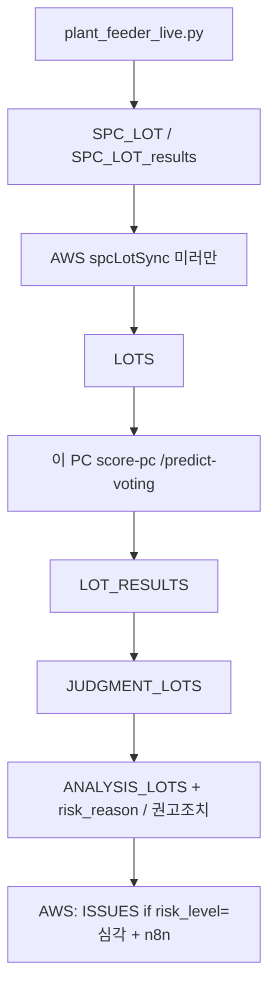

# Issue / LOT API · DB · 화면 연동

최종 갱신: 2026-08-18

Linux MariaDB(`lower_case_table_names=0`) SSOT는 **대문자 테이블명**. 런타임 SQL의 `FROM`/`JOIN`/`INTO`와 `ON DUPLICATE` 한정자(`JUDGMENT_LOTS.col`)도 대문자여야 한다.

---

## 2026-08-15에 확인한 동작

- **채점 3단은 재시작 후 실시간으로 따라잡힘.** `SPC_LOT` → `LOTS` 미러 → `LOT_RESULTS` → `JUDGMENT_LOTS` → `ANALYSIS_LOTS`. 라이브 예: 오늘 LOT 99건이 세 테이블 최신 ID까지 일치.
- **이슈 INSERT는 채점보다 늦게 붙는다 (버그 아님).** 부트 채점은 `skipIssues: true`. 60초 폴러는 **채점 → risk_reason vLLM → 권고조치 → 그다음** `ensureIssuesForRiskLots()`. 이슈 문구는 AWS `127.0.0.1:8001` vLLM을 LOT마다 기다림(`SECURE_VLLM_TIMEOUT`, 기본 90초). AWS에는 vLLM이 없어 타임아웃만 반복하면 `ISS-yyMMdd-*`가 판정 테이블보다 밀린다. 이슈 ID 날짜는 **이슈 생성 시각이 아니라 `LOTS.timestamp`**.
- **Linux 한정자 버그 (수정됨):** `ON DUPLICATE KEY UPDATE COALESCE(judgment_lots.quality_defect, …)` 는 `Unknown column`으로 **INSERT까지 실패**. `COALESCE(JUDGMENT_LOTS.quality_defect, VALUES(…))` 로 고침. 코드 재기동 후 `JUDGMENT_LOTS`가 현재 LOT까지 들어옴.
- **`ANALYSIS_LOTS.spc_chart_json`:** 대시보드 I-차트 스냅샷. 예전 실시간 채점은 스냅샷을 계산만 하고 저장하지 않아 NULL이 많음. 지금은 `updateLotScore` → `upsertAnalysisScore(..., spcChart)` 이고, 기존 값은 `COALESCE(ANALYSIS_LOTS.spc_chart_json, VALUES(spc_chart_json))`로 **NULL일 때만** 채움. 기동 전에 쌓인 NULL은 재채점 또는 `npm run refresh:spc-risk`. 상세 GET은 JSON이 없으면 `getLotSpcDetail()`로 그때 그림.

---

## 규칙

- 이슈 목록: `ISSUES.completed_at IS NULL`. `risk_level`은 **`ANALYSIS_LOTS` JOIN** (`ISSUES`에 컬럼 없음)
- 목록 DTO에 `actionContent` 없음 (상세·PUT에만)
- **완료 → Knowledge 「과거 자료」** (`completed_at IS NOT NULL`). 인수인계 이력으로 넣지 않음
- **이슈 저장(FE):** 「조치 완료 여부」체크 필수 · `completed: true`만 PUT
- 인수인계(`HANDOVER_HISTORY`): `ISSUES`와 **독립** · Knowledge는 `archivedAt||createdAt`
- **라이브러리 분석 행:** `AI_LIBRARY_ANALYSIS`는 XOR. `user_id`(선택 항목 분석) 또는 `lot_id`(과거 자료 진단 캐시). LOT당 진단 1행. **이슈 완료(`completed_at`) 직후 백그라운드 API_LLM.** ALTER [`DB/alter_ai_library_analysis_lot_id.sql`](../../DB/alter_ai_library_analysis_lot_id.sql).
- **이슈 ID:** `ISS-yyMMdd-001` 일별 순번은 **ISSUES** 전용
- **이슈 자동 생성:** `ANALYSIS_LOTS.risk_level = '심각'` 이고 그 LOT에 미완료 이슈가 없을 때 (`ensureIssuesForRiskLots`). 「주의」만으로는 안 만듦. 「심각」은 불량확률·잔류 Li·SPC 이탈 중 **최악 축** (`STANDARD` 임계, 기본 확률≥0.4 / 잔류≥3500 / SPC 라벨에 「이탈」)
- **`issue_content`:** `risk_reason` → 로컬 vLLM 한 문장. 실패 시 `buildIssueTitle`
- 위험 LOT Top: `GET /api/lots/risk-top` — **최근 3일** · `risk_level` 심각. 이슈 목록에는 3일 제한 없음
- 이슈 보고서 메일: [`issue-report.md`](./issue-report.md)
- 당일 KPI: `GET /api/lots/daily-kpi` — 당일 00시~ · `ANALYSIS_LOTS.probability` · 임계 0.8
- **채점 3단** (`lot.service` `updateLotScore`). 앙상블: [`multi-model-voting.md`](./multi-model-voting.md)
  1. `/predict-voting` → **`LOT_RESULTS`** NULL-fill (피더 실측은 COALESCE로 불변)
  2. **`JUDGMENT_LOTS`** — qd/residual ← `LOT_RESULTS`, capacity/probability ← voting, `spc` ← SPC
  3. **`ANALYSIS_LOTS`** — judgment 2차 추론 (`combineLotScore` + SPC → risk/`scored_at`/`spc_chart_json`)
- **폴러:** AWS는 SPC 미러(~60s) + 이슈/메일. `LOT_SCORE_ON_AWS=0`이면 `/predict-voting` 안 함. 채점·사유·권고조치는 이 PC `npm run score-pc`. 가이드: [`aws-pc-score-worker.md`](../guides/aws-pc-score-worker.md).
- **피더:** `frontend/plant_feeder_live.py` → `SPC_LOT` / `SPC_LOT_results`. 앱 `LOTS`는 피더가 직접 쓰지 않음. `spcLotSync`가 미러. 채점은 PC 워커.

---

## ERD (`DB/schema.sql` 전체)

라이브에만 있고 `schema.sql` CREATE가 없는 것: `SPC_LOT`, `SPC_LOT_results`(피더), `SPC_LIMITS`, `STANDARD`([`DB/spc_limits_and_standard.sql`](../../DB/spc_limits_and_standard.sql)), `OPTIMIZATION_EVENTS`(제어 Approve). SQLite: `DB/data` `llm_api_keys`.

```mermaid
erDiagram
  USERS ||--o| USER_SETTINGS : user_id
  USERS ||--o| USER_HEADER_NOTIF_STATE : user_id
  USERS ||--o{ USER_CHAT_THREADS : user_id
  USERS ||--o{ USER_SECURITY_THREADS : user_id
  USERS ||--o{ INQUIRIES : author
  USERS ||--o{ AI_LIBRARY_ANALYSIS : user_id
  LOTS ||--o{ AI_LIBRARY_ANALYSIS : lot_id
  USERS ||--o{ SEND_EMAIL : user_id
  USERS ||--o{ ISSUES : assignee
  USERS ||--o{ HANDOVER_HISTORY : assignee
  LOTS ||--o| ANALYSIS_LOTS : lot_id
  LOTS ||--o| JUDGMENT_LOTS : lot_id
  LOTS ||--o| LOT_RECOMMENDED_ACTIONS : lot_id
  LOTS ||--o{ LOT_RESULTS : lot_id
  LOTS ||--o{ ISSUES : lot_id
  LOTS ||--o{ SEND_EMAIL : lot_id
  USER_CHAT_THREADS ||--o{ USER_CHAT_MESSAGES : thread_id
  USER_SECURITY_THREADS ||--o{ USER_SECURITY_MESSAGES : thread_id
  INQUIRIES ||--o{ INQUIRY_ATTACHMENTS : inquiry_id

  USERS {
    int id PK
    varchar user_id UK
    varchar password
    varchar name
    varchar phone
    varchar email
  }
  USER_SETTINGS {
    varchar user_id PK
    int font_size
    tinyint theme_mode
    int refresh_interval
    char email_check
    char manage
  }
  USER_HEADER_NOTIF_STATE {
    varchar user_id PK
    json read_ids
    json dismissed_ids
  }
  LOTS {
    varchar id PK
    datetime timestamp
    double d50
    double d90
    double metal_impurity
    double lithium_input
    double additive_ratio
    double process_time
    double sintering_temp
    double humidity
    double tank_pressure
    varchar operator_id
  }
  ANALYSIS_LOTS {
    varchar lot_id PK
    double probability
    varchar spc_status
    varchar risk_level
    varchar risk_reason
    json spc_chart_json
    datetime scored_at
  }
  JUDGMENT_LOTS {
    varchar lot_id PK
    tinyint quality_defect
    double capacity
    double residual_li
    double probability
    varchar spc
  }
  LOT_RECOMMENDED_ACTIONS {
    varchar lot_id PK
    varchar summary
    json steps_json
    json sources_json
    varchar status
  }
  LOT_RESULTS {
    int seq PK
    varchar lot_id UK
    tinyint quality_defect
    double residual_li
    datetime measured_at
  }
  ISSUES {
    varchar issue_id PK
    varchar lot_id FK
    varchar issue_content
    text action_content
    varchar assignee_user_id
    datetime completed_at
    datetime created_at
  }
  HANDOVER_HISTORY {
    bigint history_id PK
    varchar handover_content
    text action
    varchar handover_from
    varchar handover_to
    datetime created_at
    datetime archived_at
  }
  USER_CHAT_THREADS {
    char id PK
    varchar user_id FK
    varchar channel
    varchar title
  }
  USER_CHAT_MESSAGES {
    bigint id PK
    char thread_id FK
    varchar role
    text content
    json sources
  }
  USER_SECURITY_THREADS {
    char id PK
    varchar user_id FK
    varchar title
  }
  USER_SECURITY_MESSAGES {
    bigint id PK
    char thread_id FK
    varchar role
    varchar status
    text content
    json sources
  }
  INQUIRIES {
    int id PK
    varchar inquiry_code UK
    varchar title
    text content
    varchar status
  }
  INQUIRY_ATTACHMENTS {
    int id PK
    int inquiry_id FK
    varchar original_name
  }
  AI_LIBRARY_ANALYSIS {
    bigint id PK
    varchar user_id FK
    varchar lot_id FK
    varchar name
    text analysis_content
  }
  TEXT_MATCH {
    bigint id PK
    varchar source_path UK
    varchar md_path
  }
  SEND_EMAIL {
    bigint id PK
    varchar lot_id FK
    varchar user_id FK
    longtext mail_contents
    char send
  }
```

DDL: [`DB/schema.sql`](../../DB/schema.sql)

---

## 엔드포인트

| Method | Path | Auth | 설명 |
|--------|------|------|------|
| GET | `/api/lots/risk-top` | 선택 | 최근 3일·심각 LOT |
| GET | `/api/lots/daily-kpi` | 선택 | 당일 probability KPI |
| GET | `/api/lots/q-cost` | 선택 | 품질 비용 KPI |
| GET | `/api/lots/:lotId` | 선택 | LOT 상세 (공정+채점 JOIN) |
| POST | `/api/lots/import` | JWT | CSV→`LOTS`. `?score=1`은 `LOT_SCORE_ON_AWS=0`이면 채점 안 함(이슈만) |
| POST | `/api/lots/score` | JWT | 미채점 LOT 채점. AWS `LOT_SCORE_ON_AWS=0`이면 안내 JSON만 |
| GET | `/api/issues` | 선택 | 미완료; `riskLevel`은 ANALYSIS_LOTS |
| GET | `/api/issues/:issueId` | 선택 | 상세+`analysis` |
| PUT | `/api/issues/:issueId` | JWT | `actionContent`, `completed: true` |
| GET | `/api/knowledge/past-issues` | 선택 | 완료 이슈 |
| GET | `/api/knowledge/past-issues/:issueId` | 선택 | 과거 자료 상세 |
| GET | `/api/knowledge/handover-history` | 선택 | `?status=pending\|completed` |
| POST | `/api/knowledge/handover` | JWT | 인수인계 등록 |
| POST | `/api/knowledge/analyze` | JWT | `{ message }` → user 행. `{ lotId }` → LOT 진단 캐시(멱등). `AI_LIBRARY_ANALYSIS` |
| GET | `/api/dashboard/lot-risks` | 선택 | 위험 LOT 목록 (`JUDGMENT_LOTS` INNER JOIN `LOTS`) |
| GET | `/api/dashboard/lot-risks/:lotId` | 선택 | LOT 상세 · SPC 차트 · 권고조치 |
| GET | `/api/dashboard/production-trend` | 선택 | 생산 추이 |
| GET | `/api/dashboard/production-daily` | 선택 | 일별 생산 |
| GET | `/api/dashboard/lots.csv` | 선택 | CSV 내보내기 |
| GET | `/api/dashboard/feature-importance` | 선택 | 피처 중요도 |
| POST | `/api/internal/n8n/send-email-result` | 시크릿 | n8n 콜백 → `SEND_EMAIL.send` |

FE `baseURL`은 `/api` ([`frontend/src/api/axios.ts`](../../frontend/src/api/axios.ts)).

---

## DTO 필드

| UI / JSON | DB |
|-----------|-----|
| `issueId` | `ISSUES.issue_id` |
| `createdAt` | `ISSUES.created_at` (= LOT 생산시각으로 시드) |
| `lotId` | `ISSUES.lot_id` / `LOTS.id` |
| `riskLevel` | `ANALYSIS_LOTS.risk_level` |
| `spcStatus` | `ANALYSIS_LOTS.spc_status` |
| `issueContent` | `ISSUES.issue_content` |
| `actionContent` | `ISSUES.action_content` |
| `defectProb` | `COALESCE(JUDGMENT_LOTS.probability, ANALYSIS_LOTS.probability)` |
| `residualLithium` | `JUDGMENT_LOTS.residual_li` |
| `spc` 차트 | `ANALYSIS_LOTS.spc_chart_json` 또는 라이브 재계산 |
| `libraryAnalysis` | `AI_LIBRARY_ANALYSIS` where `lot_id` (없으면 null, GET에서 LLM 없음) |

---

## 페이지 × API × 화면

전역: `AppShell` 헤더 알림·챗봇은 모든 셸 페이지에 같이 뜬다.

### 로그인 `/login`

| 화면 | API | DB |
|------|-----|-----|
| 로그인 | `POST /api/auth/login` | `USERS` |
| 회원가입 | `POST /api/auth/register`, `GET /api/auth/check-id` | `USERS` |
| 아이디 찾기 / 비밀번호 재설정 | `POST /api/auth/find-id` · `verify-reset` · `reset-password` | `USERS` |

### 헤더 · 내 정보 (전역)

| 화면 | API | DB |
|------|-----|-----|
| 종 알림 (3일) | `GET /api/lots/risk-top`, `/api/issues`, `/api/dashboard/lot-risks`, `/api/inquiries`, `/api/knowledge/handover-history` + `GET/POST /api/auth/notifications/*` | `ANALYSIS_LOTS` 심각, `ISSUES` 미조치, `HANDOVER_HISTORY` pending, `INQUIRIES` 미답변, `USER_HEADER_NOTIF_STATE` |
| 메일 수신 토글 | `GET\|PUT /api/auth/settings` | `USER_SETTINGS.email_check` |
| 내 정보 모달 | `GET\|PUT /api/auth/profile` | `USERS` (아이디·성명 읽기전용, 이메일·연락처·비밀번호 수정) |
| 로그아웃 | `POST /api/auth/logout` | 세션 |

### Main `/main`

| 화면 | API | DB |
|------|-----|-----|
| 위험 LOT Top (8건·페이지) | `GET /api/lots/risk-top` | `LOTS` + `ANALYSIS_LOTS` 심각 · 최근 3일 |
| 당일 양품/불량률 KPI | `GET /api/lots/daily-kpi` | `ANALYSIS_LOTS.probability` vs 0.8 |
| Q-Cost (월) | `GET /api/lots/q-cost` | `ANALYSIS_LOTS.risk_level` 건수 + `JUDGMENT_LOTS.quality_defect` |
| LOT 클릭 → 이슈 미리보기 | `GET /api/issues?lotId=` · `GET /api/issues/:id` | `ISSUES` + `ANALYSIS_LOTS` |

### 대시보드 `/dashboard`

목록은 **`JUDGMENT_LOTS INNER JOIN LOTS`** 이라, 판정이 없으면 피더 `LOTS`만 있어도 화면에 안 나온다.

| 화면 | API | DB |
|------|-----|-----|
| LOT 위험 테이블 | `GET /api/dashboard/lot-risks` | `JUDGMENT_LOTS` + `LOTS` + `ANALYSIS_LOTS` (확률·잔류·SPC·위험) |
| LOT 상세 패널 | `GET /api/dashboard/lot-risks/:lotId` | 공정 컬럼, `spc_chart_json` 또는 라이브 SPC, `LOT_RECOMMENDED_ACTIONS` |
| 생산 추이 차트 | `GET /api/dashboard/production-trend` | `JUDGMENT_LOTS.quality_defect` × `LOTS.timestamp` |
| 생산 상세 탭 | `GET /api/dashboard/production-daily` | 일별 집계 · `ANALYSIS_LOTS.probability` ≥ 0.8 |
| 피처 중요도 | `GET /api/dashboard/feature-importance` | 모델 FI (기간 버킷) |
| CSV | `GET /api/dashboard/lots.csv` | JOIN 스냅샷 |

### 이슈 `/issue`

| 화면 | API | DB |
|------|-----|-----|
| 미완료 목록 | `GET /api/issues` | `ISSUES` + `ANALYSIS_LOTS` (위험·SPC 필터) |
| 행 선택 상세 | `GET /api/issues/:issueId` | 조치·담당자(`USERS.name`)·`analysis` |
| 담당자 목록 | `GET /api/issues/managers` | `USER_SETTINGS.manage='O'` 의 `USERS.name` |
| 분석 시각화 | 상세의 `analysis` | `ANALYSIS_LOTS` |
| 저장(완료) | `PUT /api/issues/:id` `{ completed: true, actionContent, assigneeUserId }` | `completed_at`, `action_content`, `assignee_user_id` → 목록에서 사라지고 Knowledge 과거 자료 |

### Knowledge `/knowledge`

| 화면 | API | DB |
|------|-----|-----|
| 과거 자료 | `GET /api/knowledge/past-issues` · `/:id` | 완료 `ISSUES` + `LOTS`/`ANALYSIS_LOTS` + `AI_LIBRARY_ANALYSIS.lot_id`(있으면). **`USER_SETTINGS.manage='O'`** |
| 인수인계(완료) | `GET /api/knowledge/handover-history?status=completed` | `HANDOVER_HISTORY` |
| 선택 항목 분석 | `POST /api/knowledge/analyze` `{ message }` | `AI_LIBRARY_ANALYSIS.user_id`. **manage='O'** |
| 과거 자료 진단 | 이슈 완료 시 백그라운드 / 모달은 GET 캐시 (없으면 1회 백필 `POST … { lotId }`) | `AI_LIBRARY_ANALYSIS.lot_id` |
| 문서 미리보기 | `GET /api/docs/file` | 파일시스템 + `TEXT_MATCH` (OCR 경로) |

### 문의 `/inquiry`

| 화면 | API | DB |
|------|-----|-----|
| 목록/작성 | `GET\|POST /api/inquiries` | `INQUIRIES`. 비공개 본문은 작성자 또는 `USER_SETTINGS.manage='O'` |
| 첨부 | 목록 첨부 URL | `INQUIRY_ATTACHMENTS` |
| 답변 | `POST\|PATCH /api/inquiries/:id/answer` | `INQUIRIES.answer`. 답변은 manage='O' |

### 설정 `/setting`

시스템만 (폰트·테마·새로고침·알림). 개인정보는 헤더 모달.

| 화면 | API | DB |
|------|-----|-----|
| 환경 저장 | `GET\|PUT /api/auth/settings` · `POST .../reset` | `USER_SETTINGS` (`manage`는 GET만, PUT으로 바꾸지 않음) |
| 제어 한계치 | `GET\|PUT /api/settings/control-bounds` | JSON 파일 (테이블 아님) |

### 관리 `/management`

Grafana SPC iframe. MariaDB LOT 테이블을 직접 읽지 않음 (`NEXT_PUBLIC_GRAFANA_*`).

### `/security`

페이지 챗 없음. 플로팅 챗봇 「보안 상담」 탭을 연 뒤 `/main`으로 이동.

### 플로팅 챗봇 (전역)

| 화면 | API | DB |
|------|-----|-----|
| 일반 상담 | `POST /api/chat` · `/stream`, `GET /api/chat/threads*` | `USER_CHAT_THREADS` / `USER_CHAT_MESSAGES` |
| 보안 상담 | `POST /api/security-chat/stream` | AWS는 `USER_SECURITY_MESSAGES` pending만. 이 PC 워커가 RAG+vLLM 후 assistant. 출처 패널은 **전체화면(`isExpanded`)만** |
| 제어 제안 승인 | `POST /api/control/approve` · revert · outcome | `OPTIMIZATION_EVENTS` |

---

## 이슈 페이지 FE

- 목록 = `GET /api/issues` 미완료.
- 행 선택 = `GET /api/issues/:issueId` → `assigneeName`, `actionContent`, `analysis`.
- 담당자 select = `GET /api/issues/managers` (`USER_SETTINGS.manage='O'`).
- 저장 = 완료만. JWT PUT `assigneeUserId`(관리자 user_id 또는 빈 값) 후 Knowledge 「과거 자료」.
- 처리 상태(`status`) 필터 없음.

시드: [`DB/issues_seed.sql`](../../DB/issues_seed.sql) — mock LOT만, issues INSERT 없음.
